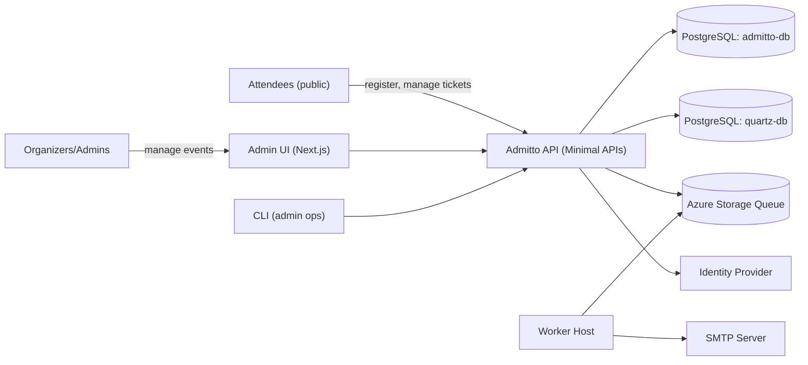
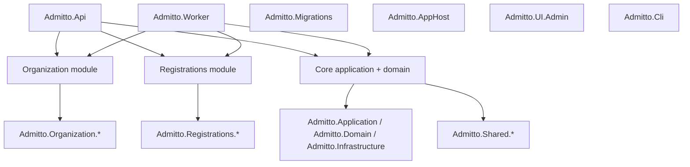
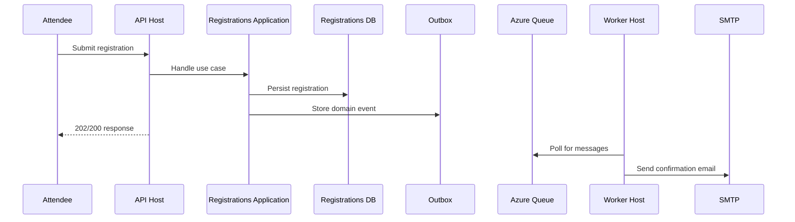
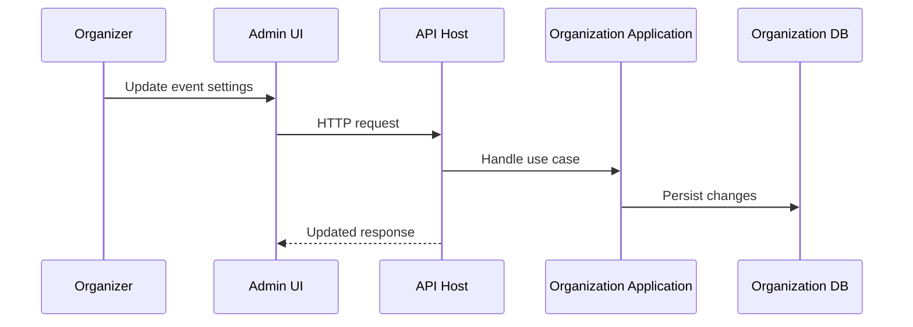
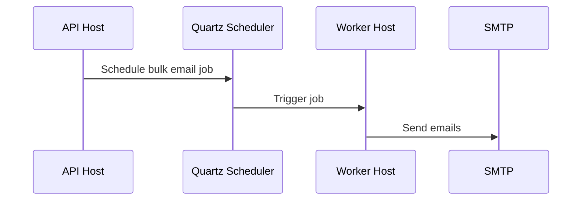
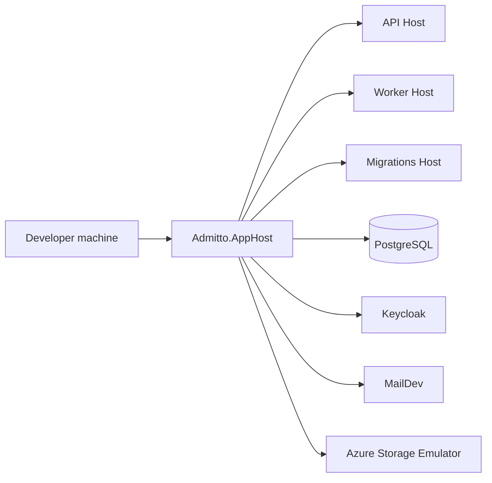

# Admitto arc42 Architecture

## 1. Introduction and Goals

**System overview**
Admitto is an open-source ticketing system for small, free events. It supports event organizers with team management, ticketed event configuration, attendee registration, and email communication, while providing a public-facing registration experience for attendees.

**Business goals**
- Allow organizers to create and manage ticketed events with minimal operational overhead.
- Provide a reliable, self-service attendee registration and ticket management flow.
- Support organizer workflows like bulk email, confirmations, and check-in.

**Quality goals**
- Modularity and maintainability through clear boundaries.
- Operational simplicity over distributed complexity.
- Reliability in registration and communication flows.
- Security for authentication and organizer access.

**Key stakeholders**
- Attendees (public registration and ticket access).
- Organizers and team members (event setup and operations).
- Administrators and support (operational oversight).
- Developers and operators (build, deploy, maintain).

## 2. Constraints

- .NET 10 SDK and C# are required (see `global.json`).
- Modular monolith with multiple hosts (API and Worker) per ADR-001.
- Minimal APIs with feature-sliced endpoints per ADR-002.
- PostgreSQL is the primary datastore with separate schemas per module.
- EF Core is the ORM; FluentValidation is used for validation.
- Local orchestration uses .NET Aspire AppHost.
- OpenAPI is exposed and documented via Scalar.

## 3. Context and Scope

**In scope**
- Organizer-facing administration (teams, events, tickets, attendees, emails).
- Public registration and attendee self-service actions.
- Background processing for emails, outbox dispatching, and scheduled tasks.

**External dependencies**
- Identity provider (Keycloak or Microsoft Graph for API auth).
- SMTP for outbound email.
- Azure Storage Queues for internal messaging.
- PostgreSQL for persistence and Quartz scheduling data.

## 4. Solution Strategy

- Modular monolith with explicit module boundaries for Organization and Registrations.
- Multiple hosts to isolate HTTP traffic from background processing.
- DDD-inspired layering: Domain, Application, Infrastructure per module.
- Outbox pattern for reliable asynchronous messaging.
- EF Core with schema-per-module to reduce data coupling.
- Aspire AppHost for local orchestration of dependencies.

## 5. Building Block View

**Level 1: System overview**
- API Host: minimal APIs and request handling.
- Worker Host: background processing, messaging, and scheduled work.
- Migrations Host: applies database schema changes.
- Admin UI: Next.js-based organizer interface.
- CLI: admin and operational tooling.
- AppHost: Aspire-based local orchestration.

**Level 2: Module responsibilities**
- Organization module: teams, users, and ticketed event configuration.
- Registrations module: attendee registrations and capacity tracking.
- Core application/domain: attendees, tickets, emails, and shared behaviors.
- Shared module: cross-cutting abstractions for messaging, validation, and infrastructure.

## 6. Runtime View

**Public registration flow**

**Organizer updates event configuration**

**Scheduled/bulk email**

## 7. Deployment View

**Local development (Aspire AppHost)**
- `Admitto.AppHost` orchestrates dependencies and services.
- Containers: PostgreSQL, Keycloak, MailDev, Azure Storage emulator.
- Services: API Host, Worker Host, Migrations Host.

**Production (typical)**
- Containerized API and Worker services.
- External PostgreSQL, identity provider, SMTP, and queue service.
- Migrations run as a job during deployment.

## 8. Cross-cutting Concepts

- Authentication and authorization: bearer tokens; API integrates with Keycloak or Microsoft Graph; Admin UI uses BetterAuth.
- Validation: FluentValidation with shared helpers; validation results map to HTTP Problem Details.
- Error handling: centralized exception handling in API; domain rule errors surfaced as application errors.
- Messaging: Azure Storage Queues with outbox persistence for reliability.
- Persistence: EF Core DbContexts with schema-per-module; migrations via `Admitto.Migrations` and infrastructure migrators.
- Observability: OpenTelemetry, health endpoints (`/health`, `/alive`), request timeouts, output caching via `Admitto.ServiceDefaults`.
- Configuration: appsettings and environment variables for connection strings and auth endpoints.

## 9. Architectural Decisions

- ADR-001 Modular Monolith with Multiple Hosts: `../adrs/adr-001-modular-monolith.md`
- ADR-002 Minimal APIs with Feature-Sliced Endpoint Organization: `../adrs/adr-002-minimal-api.md`

## 10. Quality Requirements

**Quality tree**
- Maintainability: clear module boundaries and feature slicing.
- Reliability: outbox-based messaging and transactional persistence.
- Security: centralized authentication and authorization policies.
- Operability: health checks and OpenTelemetry integration.

**Key scenarios**
- Attendee registration should persist data and send confirmation reliably.
- Organizer updates must reflect quickly with consistent validation.
- Background work should not block API responsiveness.

## 11. Risks and Technical Debt

- Worker Host background processing is partially stubbed and needs completion.
- Outbox dispatching for orphaned messages is marked as TODO.
- Admin UI orchestration in AppHost is not wired and throws `NotImplementedException`.
- Mixed identity providers (Keycloak/Microsoft Graph/BetterAuth) add integration complexity.

## 12. Glossary

- Attendee: A person registering for an event.
- Team: Organizers who manage events in Admitto.
- Ticketed Event: An event with ticket types and capacity rules.
- Ticket Type: A specific category of ticket within an event.
- Registration: A record of an attendee’s participation.
- Contributor/Participant: Domain roles representing event involvement.
- Outbox: Persistent queue of messages to be delivered asynchronously.
