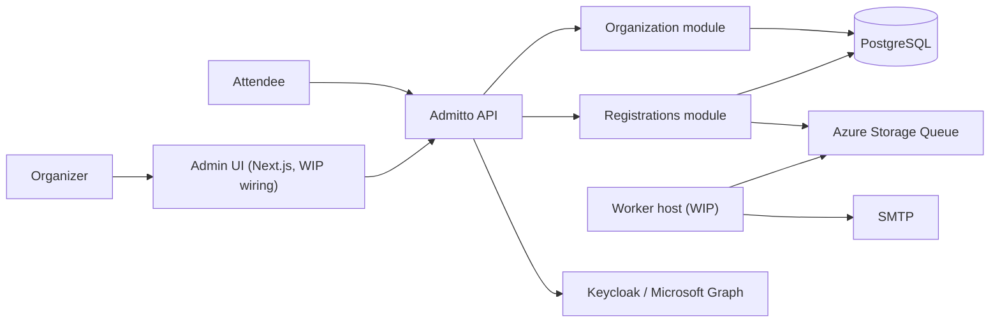
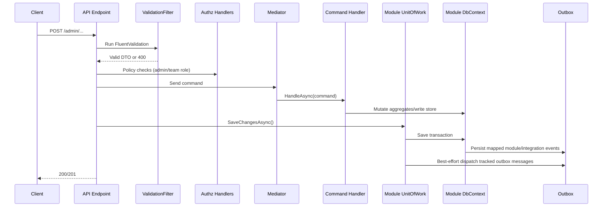
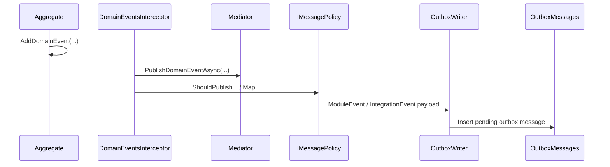

# Admitto arc42 Architecture

## 1. Introduction and Goals

**System overview**  
Admitto is an open-source ticketing system for small, free events. It supports organizer workflows (teams, event setup, attendee operations) and attendee-facing registration flows.

**Business goals**
- Enable small teams to manage free ticketed events with low operational overhead.
- Keep registration and capacity handling reliable under concurrent usage.
- Keep architecture modular so features can evolve without service sprawl.

**Quality goals**
- Maintainability through explicit module boundaries.
- Reliability through transactional writes and outbox-based async messaging.
- Operational simplicity through a modular monolith and shared platform defaults.
- Security through centralized authn/authz patterns.

**Stakeholders**
- Attendees
- Organizers and team members
- Operators and support engineers
- Developers

## 2. Constraints

- .NET SDK `10.0.100` and C# `latest` (see `global.json`, `Directory.Build.props`).
- Modular monolith with multiple runtime hosts (ADR-001).
- Minimal APIs with feature slicing (ADR-002).
- PostgreSQL as primary datastore, schema-per-module.
- EF Core for persistence.
- FluentValidation for request validation.
- Azure Storage Queue for outbox dispatch targets.
- Local orchestration via .NET Aspire AppHost.

## 3. Context and Scope

**In scope**
- Organization module: teams, memberships, event metadata.
- Registrations module: registration and capacity tracking.
- Shared module: kernel, messaging abstractions, infrastructure plumbing.
- Hosts: API, migrations, worker, AppHost (local orchestration).

**External dependencies**
- Identity provider: Keycloak or Microsoft Graph-backed user directory workflows.
- PostgreSQL (`admitto-db`, `quartz-db`, `better-auth-db` in local app host).
- Azure Storage Queue.
- SMTP (MailDev locally).

## 4. Solution Strategy

- Keep a **single deployable system** with **explicit module boundaries**.
- Separate runtime concerns with dedicated hosts (API vs background/migrations).
- Use DDD-inspired layering inside modules: `Domain`, `Application`, `Infrastructure`, `Contracts`.
- Use transactional domain event processing + outbox for reliable asynchronous propagation.
- Use keyed DI (`moduleKey`) to isolate module-specific resources (notably `IUnitOfWork`, message policies).

## 5. Building Block View

### 5.1 Level 1: Solution Structure

Primary, active solution structure is defined in `Admitto.slnx`:
- Hosts: `src/Admitto.Api`, `src/Admitto.Worker`, `src/Admitto.Migrations`, `src/Admitto.AppHost`, `src/Admitto.Cli`
- Modules:
  - Organization: `src/Admitto.Organization.*`
  - Registrations: `src/Admitto.Registrations.*`
  - Shared: `src/Admitto.Shared.*`

Note: legacy projects (`src/Admitto.Application`, `src/Admitto.Domain`, `src/Admitto.Infrastructure`) are present in the repo but are not the primary architecture baseline documented here.

### 5.2 Level 2: Module Decomposition

- `*.Domain`: aggregates, value objects, domain events.
- `*.Application`: use cases, handlers, validators, module event handlers, facades.
- `*.Infrastructure`: EF Core DbContext/configuration, converters, external adapters.
- `*.Contracts`: cross-module DTOs and external contract surfaces.

### 5.3 Architecture Pattern Catalog

| Pattern | Purpose | Where | Rule |
|---|---|---|---|
| Module key + keyed DI | Isolate module resources | `AddModuleDatabaseServices<TWriteModel, TDbContext>()` in `src/Admitto.Shared.Infrastructure/DependencyInjection.cs` | Register module `IUnitOfWork` as keyed service; resolve by module key in endpoints/integration handling. |
| Feature-sliced minimal endpoints | Keep HTTP layer cohesive per use case | `UseCases/*/*HttpEndpoint.cs` | Endpoint, request DTO, validator, and mapping stay together. |
| Endpoint-owned unit of work | Keep transaction boundary in transport layer | e.g. `CreateTeamHttpEndpoint`, `UpdateTeamHttpEndpoint`, `AssignTeamMembershipHttpEndpoint` | Endpoint commits once (`IUnitOfWork.SaveChangesAsync` or equivalent endpoint helper). Command handlers do not commit. |
| Thin command handlers | Keep business logic persistence-focused and framework-agnostic | `*Handler.cs` under module Application projects | Handlers mutate domain/write models only; no HTTP concerns; no direct transaction commits. |
| Query/command mediator split | Explicit intent separation | `IMediator` + `ICommandHandler` + `IQueryHandler` in `src/Admitto.Shared.Application/Messaging` | Reads use queries; writes use commands. |
| Validation in endpoint filter | Validate request DTOs before handler execution | `src/Admitto.Api/Middleware/ValidationFilter.cs` applied in `src/Admitto.Api/Endpoints/AdminEndpoints.cs` | For admin endpoints, FluentValidation has already run when endpoint handler executes. |
| Organization scope binding | Resolve route slugs once and pass typed scope | `OrganizationScope` + `OrganizationScopeResolver` | Use `OrganizationScope` in endpoints instead of repeatedly parsing route values. |
| Domain events | Capture business-significant state transitions inside aggregates | Aggregate base in `src/Admitto.Shared.Kernel/Entities/Aggregate.cs` + module domain events | Domain events are raised in domain model and dispatched during `SaveChanges` interceptor. |
| Message policy mapping | Map domain events to module/integration events declaratively | `IMessagePolicy` / `MessagePolicy` + module policies | Event publication is policy-driven; mapping is module-owned. |
| Module events | Internal async reactions within/between modules | `*.Application.ModuleEvents` (e.g. `UserCreatedModuleEvent`) | Namespaces must follow `Amolenk.Admitto.<Module>.Application.ModuleEvents`. |
| Integration events | External/public integration contracts | `*.Contracts.IntegrationEvents` | Namespaces must follow `Amolenk.Admitto.<Module>.Contracts.IntegrationEvents`. |
| Outbox pattern | Reliable async message persistence and dispatch | `DomainEventsInterceptor`, `OutboxWriter`, `OutboxDispatcher`, `OutboxMessageSender` | Persist event payloads in same DB transaction, dispatch best-effort immediately, retry/orphan handling delegated to background processing. |
| Facade for cross-module queries | Avoid direct module DB coupling | `IOrganizationFacade` + `OrganizationFacade` | Cross-module reads go through contracts/facades, not direct DbContext access across modules. |
| Decorator caching | Add optional cross-module lookup cache without changing contract | `CachingOrganizationFacade` | Cache is configuration-driven and wraps facade implementation. |

## 6. Runtime View

### 6.1 Admin Command Flow (Write)

### 6.2 Domain Event to Module/Integration Event Flow

### 6.3 Cross-Module Query Flow

- Endpoint/auth scope resolver calls `IOrganizationFacade` for team/event lookup and membership role checks.
- Facade routes to internal module queries via `IMediator.QueryAsync`.
- Optional caching decorator wraps facade for repeated lookup paths.

## 7. Deployment View

### 7.1 Local Development (Aspire AppHost)

`src/Admitto.AppHost` orchestrates:
- `api`, `worker`, `migrations`
- `postgres` (`admitto-db`, `quartz-db`, `better-auth-db`)
- `keycloak`
- storage queue emulator (`queues`)
- `maildev`

### 7.2 Production Shape (typical)

- API and worker as separate containerized workloads.
- PostgreSQL, queue service, SMTP, and IdP as managed dependencies.
- Migrations run as a deployment job.

## 8. Cross-cutting Concepts

- **Authentication/authorization**: JWT bearer auth; policy handlers for admin role and team membership role.
- **Validation**: FluentValidation validators discovered per module; admin endpoint filter converts failures to HTTP validation problems.
- **Error handling**: exception handlers map business rule violations and unexpected failures to Problem Details.
- **Persistence**: EF Core DbContext per module; schema-per-module; shared interceptors for auditing/domain events.
- **Messaging**: outbox + queue sender; message type derived from event namespace and name.
- **Observability and operability**: service defaults include OpenTelemetry, health checks (`/health`, `/alive`), request timeouts, output caching.

## 9. Architectural Decisions

- ADR-001: Modular Monolith with Multiple Hosts  
  `adrs/adr-001-modular-monolith.md`
- ADR-002: Minimal APIs with Feature-Sliced Endpoint Organization  
  `adrs/adr-002-minimal-api.md`

## 10. Quality Requirements and Test Strategy

**Quality focus**
- Maintainability: enforce module boundaries and feature cohesion.
- Reliability: transactional writes and outbox persistence.
- Security: policy-driven authorization per endpoint.
- Operability: health checks + telemetry defaults.

**Testing strategy**
- Domain rules: fast unit tests in `tests/Admitto.Organization.Domain.Tests` and `tests/Admitto.Registrations.Domain.Tests`.
- Module integration behavior: Aspire-backed integration tests in `tests/Admitto.Organization.Application.Tests` and `tests/Admitto.Registrations.Application.Tests`.
- End-to-end host wiring: `tests/Admitto.Api.Tests`.

## 11. Risks and Technical Debt

- Worker processing pipeline is currently stubbed/commented; asynchronous dispatch handling remains partially implemented.
- Outbox orphan dispatch path is marked TODO.
- Admin UI orchestration in AppHost is not yet wired.
- Registrations and related tests are under active refactoring; keep contracts, handlers, and tests aligned when changing that module.

## 12. Glossary

- **Domain event**: event raised by an aggregate to represent a business state transition inside the same transaction.
- **Module event**: internal asynchronous event derived from a domain event for module-level workflows.
- **Integration event**: external/public contract event for module-to-module or external integration boundaries.
- **Unit of work**: transaction boundary that persists module changes (and outbox effects).
- **Write store**: module-owned persistence abstraction (`IOrganizationWriteStore`, `IRegistrationsWriteStore`).
