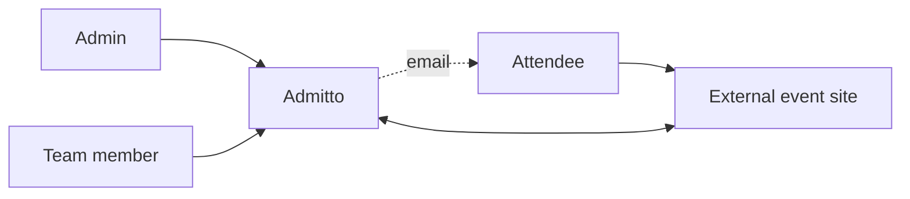
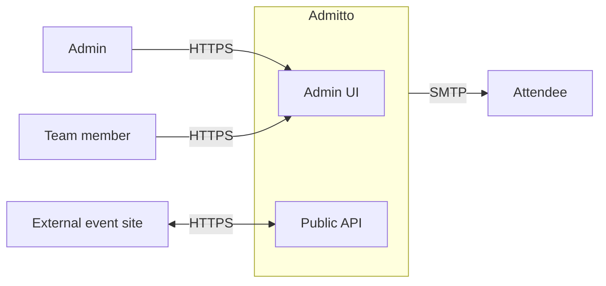

# 3. Context and scope

## 3.1 Business context

| Neighbor | Direction | Exchanged value / data |
| :------- | :-------- | :--------------------- |
| Admin | Inbound | Creates and manages teams, events, and attendee operations |
| Team member | Inbound | Manages events and attendee operations within their team scope |
| External event site | Bidirectional | Calls Admitto API to query ticket types, register attendees, etc. Owns the attendee-facing UX |
| Attendee | Outbound only | Admitto may send emails (e.g. confirmation) directly to attendees. Attendees never interact with Admitto directly — they use external event sites |

## 3.2 Technical context

| Interface | Consumers | Protocol / format |
| :-------- | :-------- | :---------------- |
| Admin UI | Admins, team members | HTTPS |
| Public API | External event sites | HTTPS / JSON |
| E-mail | Attendees | SMTP |

