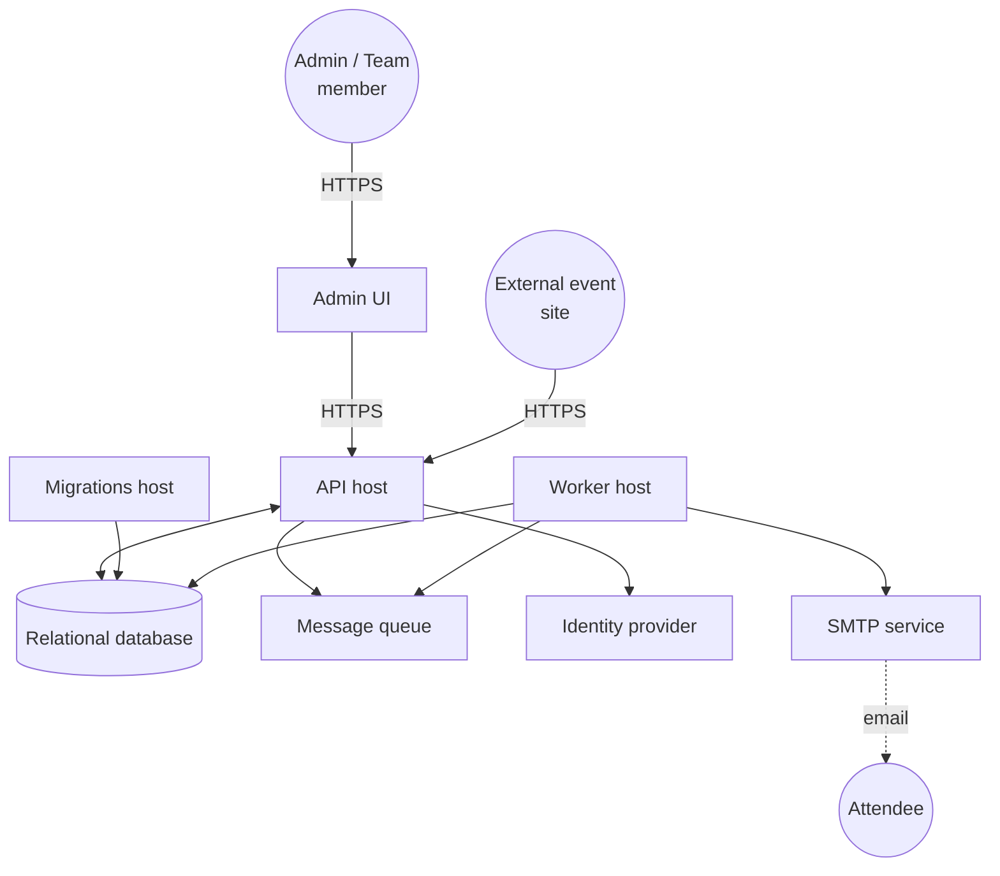
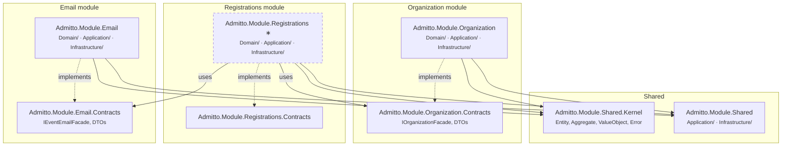

# 5. Building block view

## 5.1 Hosts

Admitto runs as multiple host processes. Each host has a distinct runtime responsibility but loads the same module libraries — activating only the capabilities it needs.



| Building Block | Responsibility | Technology |
| :--- | :------------- | :-------- |
| `Admitto.Api` | API request handling | .NET |
| `Admitto.Worker` | Background processing | .NET |
| `Admitto.Migrations` | Database schema migration | .NET |
| `Admitto.AppHost` | Aspire orchestration for local development | .NET |
| `Admitto.Cli` | CLI management tool | .NET |
| `Admitto.UI.Admin` | Frontend UI for admin/team member interaction | Next.js ([ADR-006](../adrs/adr-006-admin-ui-technology-stack.md)) |

### Infrastructure mapping

The diagram uses concept names. Actual implementations vary by environment:

| Concept | Local dev (Aspire) | Production |
| :------ | :----------------- | :--------- |
| Relational database | PostgreSQL container | Azure Database for PostgreSQL |
| Message queue | Azure Storage Queue emulator (Azurite) | Azure Storage Queues |
| Identity provider | Keycloak container | Microsoft Entra External ID |
| SMTP service | MailDev | 3rd Party SMTP service of choice |

## 5.2 Modules

Modules are not owned by a single host — they are shared libraries that contain domain logic, application use cases, and infrastructure. Each module has two projects: one main project (with `Domain/`, `Application/`, and `Infrastructure/` folders) and a separate Contracts project. Cross-module dependencies only go through Contracts.



_∗ Dashed = scaffolded but not yet fully wired._

Each module project uses folder-based layer separation internally:

| Folder | Contains |
| :----- | :------- |
| `Domain/` | Aggregates, value objects (see [§8.8 Value objects](08-crosscutting-concepts.md#88-value-objects)), domain events |
| `Application/` | Command/query handlers, validators, facades, message policies, module events |
| `Infrastructure/` | EF Core DbContext, entity configurations, value converters, external adapters |

The Contracts project (`*.Contracts`) holds DTOs, facade interfaces, and integration events — the module's public surface.

### Organization module

Manages teams, team membership and roles, and acts as the **gatekeeper** for ticketed-event creation. Does not own event metadata beyond a small set of per-team counters (`ActiveEventCount`, `CancelledEventCount`, `ArchivedEventCount`, `PendingEventCount`) and a bounded `TeamEventCreationRequest` child entity for in-flight creation requests. Publishes `TicketedEventCreationRequested` and consumes `TicketedEventCreated` / `TicketedEventCreationRejected` / `TicketedEventCancelled` / `TicketedEventArchived` integration events to keep the counters in sync. Integrates with external identity providers (Keycloak, Microsoft Graph) for user provisioning.

### Registrations module

Owns the authoritative `TicketedEvent` aggregate (slug, name, dates, lifecycle status, and consolidated policy value objects) as well as attendee registration flows (both admin-initiated and public self-service) and ticket type configuration (the `TicketCatalog` aggregate).

`TicketedEvent` consolidates three policy value objects:

| Value object | Purpose |
| :----------- | :------ |
| `TicketedEventRegistrationPolicy` | Registration window (opens/closes at) and optional email-domain restriction. |
| `TicketedEventCancellationPolicy` | Late-cancellation cutoff. Optional — absence means no cancellation is ever late. |
| `TicketedEventReconfirmPolicy` | Reconfirmation window (opens/closes at) and cadence. Optional — absence means no reconfirmation. |

Policy mutators on `TicketedEvent` reject when the event's status is not Active, so there is no separate lifecycle-guard aggregate. The existing `TicketCatalog` aggregate is extended with a single `EventStatus` field that is projected from `TicketedEvent` in the same unit of work as any lifecycle transition, providing an atomic status + capacity gate on ticket claims. See [ADR-008](../adrs/adr-008-ticketed-event-ownership-in-registrations.md) for the ownership rationale.

Registration openness is derived from `now ∈ [opensAt, closesAt)` combined with `TicketedEvent.Status == Active` — there is no explicit "open/close registration" toggle.

### Email module

Owns all email concerns: server settings, customisable templates, outgoing-email log, and actual SMTP sending.

- **Settings** — a unified `EmailSettings` aggregate keyed by `(Scope, ScopeId)` where `Scope ∈ {Team, Event}`. Settings store SMTP host/port, from-address, auth mode, and (encrypted) credentials. Effective settings for an event are resolved as: event-scoped row → team-scoped row → none.
- **Templates** — an `EmailTemplate` aggregate also keyed by `(Scope, ScopeId, Type)`. Template lookup follows the same precedence: event-scoped → team-scoped → built-in default (embedded resource). Rendering uses the Scriban engine.
- **Email log** — each send attempt is recorded as an `EmailLog` row for idempotency (redelivered integration events do not produce duplicate sends) and observability.
- **Sending** — the Worker host handles `AttendeeRegistered` integration events by resolving effective settings and templates, rendering the email, and dispatching it via SMTP. This path requires `HostCapability.Email` (see capability gating, §5.4).

Exposes `IEventEmailFacade` via `Admitto.Module.Email.Contracts` so the Registrations module can check whether email is configured before allowing registration to open. SMTP passwords are protected at rest via ASP.NET Data Protection (see [§8.7.x Secret protection](08-crosscutting-concepts.md#secret-protection)).

### Shared module

Contains code re-used across modules. It should be kept as light-weight as possible.

## 5.3 Admin UI

The Admin UI (`Admitto.UI.Admin`) is a Next.js 15 application that serves organizers and team members. It communicates exclusively with the API host over HTTPS and is deployed as a separate container.

### Architecture

The application uses the Next.js App Router with two route groups:

- **`(auth)`** — Unauthenticated pages (sign-in). Minimal layout, no session check.
- **`(dashboard)`** — Protected pages. The layout performs a server-side session check and redirects to `/signin` if the user is not authenticated.

### Key patterns

| Pattern | Implementation |
| :------ | :------------- |
| **Component library** | Shadcn/UI (new-york variant) with Radix UI primitives. Reusable primitives live in `components/ui/`; app-specific compositions in `components/`. |
| **Form handling** | React Hook Form + Zod schemas. A custom `useCustomForm` hook maps server-side ProblemDetails errors (field-level and general) to form state. |
| **API client** | HeyAPI-generated TypeScript SDK from the Admitto API OpenAPI spec. Runtime config in `lib/admitto-api/admitto-client.ts` injects base URL and access token. |
| **Data fetching** | TanStack Query for client-side data fetching with caching, deduplication, and background refetch. |
| **Data tables** | TanStack Table v8 with sorting, filtering, pagination, and faceted search. |
| **Authentication** | Better Auth with generic OAuth plugin. OIDC discovery against the identity provider; access tokens forwarded to the Admitto API via the generated SDK. |
| **State management** | Zustand for cross-component state (team selection). Page-level UI state uses React local state. |

### Folder structure

```
app/
├── (auth)/             # Unauthenticated route group
├── (dashboard)/        # Protected route group (session check in layout)
│   └── teams/          # Team and event management pages
├── api/                # Next.js API routes (BFF proxy layer)
├── components/         # App-specific components
│   └── ui/             # Shadcn/UI primitives
├── hooks/              # Custom React hooks
├── lib/                # Utilities, auth config, API client
│   └── admitto-api/    # Generated SDK + runtime config
└── stores/             # Zustand stores
```

See [ADR-006](../adrs/adr-006-admin-ui-technology-stack.md) for technology selection rationale.

### 5.2.1 Capability gating

Both the API and the Worker hosts load the same module assemblies, but some handlers depend on infrastructure that is only available in a specific host. For example, email-sending handlers need SMTP access, which only the Worker host provides. Capability gating prevents these handlers from being registered in the wrong host. See [ADR-005](../adrs/adr-005-capability-gating.md) for the full rationale.

Handlers that need host-specific infrastructure are annotated with `[RequiresCapability(HostCapability.Email)]`. At startup, each host declares which capabilities it supports. During assembly scanning, only handlers whose required capabilities match are registered in the DI container — the rest are silently skipped.