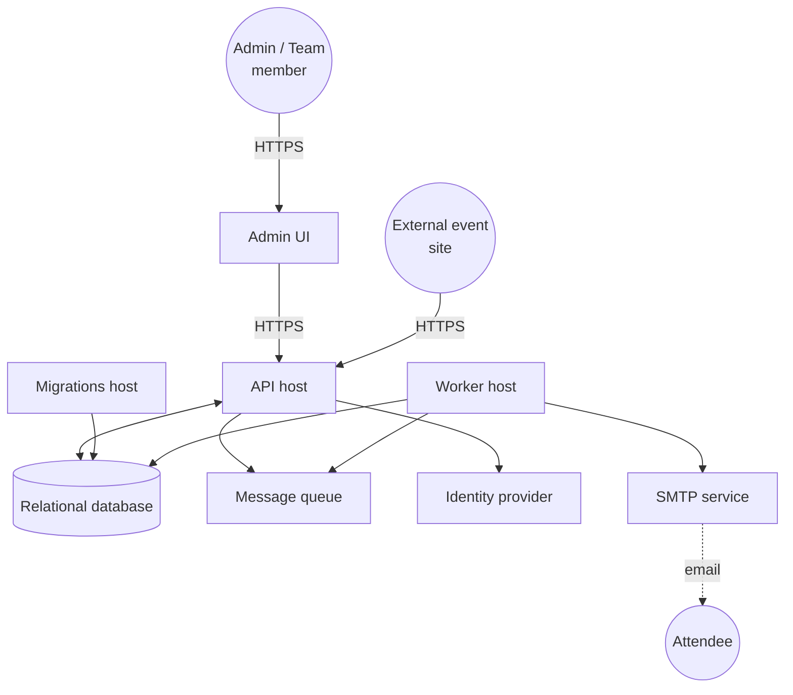
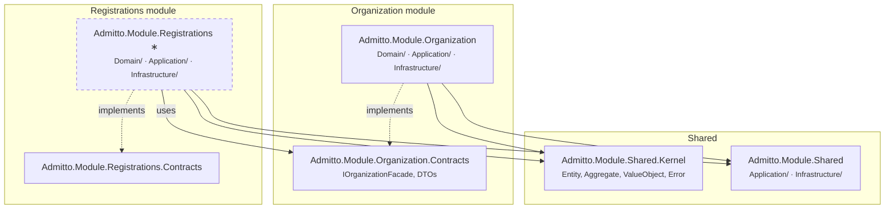

# 5. Building block view

## 5.1 Hosts

Admitto runs as multiple host processes. Each host has a distinct runtime responsibility but loads the same module libraries — activating only the capabilities it needs.

| Building Block | Responsibility | Technology |
| :--- | :------------- | :-------- |
| `Admitto.Api` | API request handling | .NET |
| `Admitto.Worker` | Background processing | .NET |
| `Admitto.Migrations` | Database schema migration | .NET |
| `Admitto.AppHost` | Aspire orchestration for local development | .NET |
| `Admitto.Cli` | CLI management tool | .NET |
| `Admitto.UI.Admin` | Frontend UI | Next.js |

### Infrastructure mapping

The diagram uses concept names. Actual implementations vary by environment:

| Concept | Local dev (Aspire) | Production |
| :------ | :----------------- | :--------- |
| Relational database | PostgreSQL container | Azure Database for PostgreSQL |
| Message queue | Azure Storage Queue emulator (Azurite) | Azure Storage Queues |
| Identity provider | Keycloak container | Microsoft Entra External ID |
| SMTP service | MailDev | 3rd Party SMTP service of choice |

## 5.2 Modules

Modules are not owned by a single host — they are shared libraries that contain domain logic, application use cases, and infrastructure. Each module has two projects: one main project (with `Domain/`, `Application/`, and `Infrastructure/` folders) and a separate Contracts project. Cross-module dependencies only go through Contracts.

_∗ Dashed = scaffolded but not yet fully wired._

Each module project uses folder-based layer separation internally:

| Folder | Contains |
| :----- | :------- |
| `Domain/` | Aggregates, value objects, domain events |
| `Application/` | Command/query handlers, validators, facades, message policies, module events |
| `Infrastructure/` | EF Core DbContext, entity configurations, value converters, external adapters |

The Contracts project (`*.Contracts`) holds DTOs, facade interfaces, and integration events — the module's public surface.

### Organization module

Manages teams, team membership and roles, and ticketed events (including ticket type configuration). Integrates with external identity providers (Keycloak, Microsoft Graph) for user provisioning.

### Registrations module

Handles attendee registration flows — both admin-initiated and public self-service — with capacity-aware ticket allocation. _(Under active development.)_

### Shared module

Contains code re-used across modules. It should be kept as light-weight as possible.

### 5.2.1 Capability gating

Both the API and the Worker hosts load the same module assemblies, but some handlers depend on infrastructure that is only available in a specific host. For example, email-sending handlers need SMTP access, which only the Worker host provides. Capability gating prevents these handlers from being registered in the wrong host. See [ADR-005](../adrs/adr-005-capability-gating.md) for the full rationale.

Handlers that need host-specific infrastructure are annotated with `[RequiresCapability(HostCapability.Email)]`. At startup, each host declares which capabilities it supports. During assembly scanning, only handlers whose required capabilities match are registered in the DI container — the rest are silently skipped.