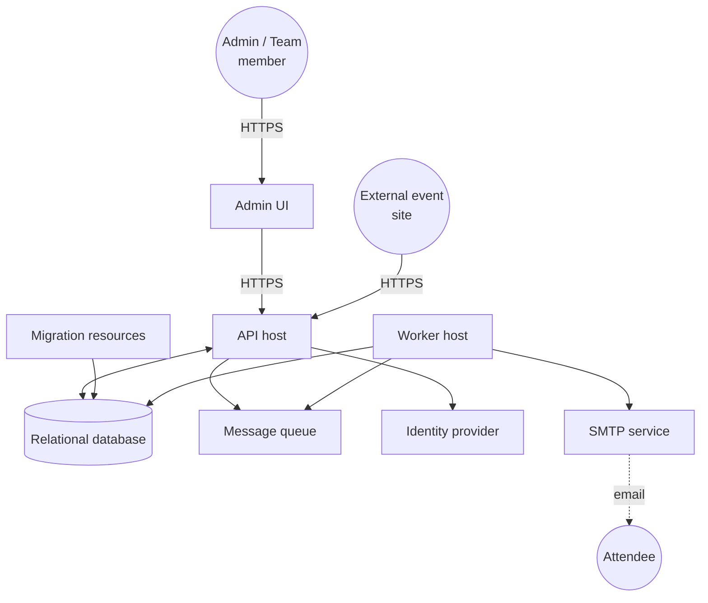
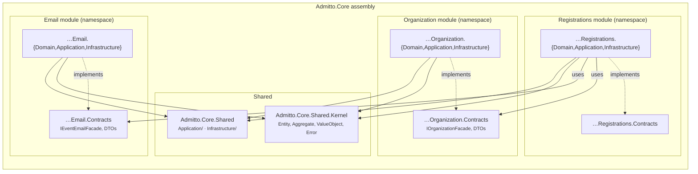

# 5. Building block view

## 5.1 Hosts

Admitto runs as multiple long-running host processes plus AppHost-modeled schema setup resources. Each host has a distinct runtime responsibility but loads the same module libraries — activating only the capabilities it needs.


```mermaid
flowchart TB
  Admin["Admin / Team<br/>member"]@{ shape: circle }
  DB[("Relational database")]
  EventSite["External event<br/>site"]@{ shape: circle }
  Attendee["Attendee"]@{ shape: circle }

  AdminUI["Admin UI"]
  api["API host"]
  worker["Worker host"]
  migrations["Migration resources"]

  Admin -->|HTTPS| AdminUI
  AdminUI -->|HTTPS| api
  EventSite -->|HTTPS| api
  api <--> DB
  api --> Queue["Message queue"]
  api --> IdP["Identity provider"]
  SMTP -.->|email| Attendee
  migrations --> DB
  worker --> Queue
  worker --> DB
  worker --> SMTP["SMTP service"]
```

| Building Block | Responsibility | Technology |
| :--- | :------------- | :-------- |
| `Admitto.Api` | API request handling | .NET |
| `Admitto.Worker` | Background processing | .NET |
| `Admitto.AppHost` | Aspire orchestration for local development and Azure deployment | .NET |
| `Admitto.UI.Admin` | Frontend UI for admin/team member interaction | Next.js ([ADR-006](../adr/adr-006-admin-ui-technology-stack.md)) |

Database schema setup is modeled in `Admitto.AppHost`: EF-owned application schemas use Aspire EF migration resources, while non-EF Quartz and Better Auth schemas are versioned SQL files under `Admitto.AppHost/DatabaseScripts/`.

### Infrastructure mapping

The diagram uses concept names. Actual implementations vary by environment:

| Concept | Local dev (Aspire) | Production |
| :------ | :----------------- | :--------- |
| Relational database | PostgreSQL container | Azure Database for PostgreSQL |
| Message queue | Azure Service Bus emulator | Azure Service Bus |
| Identity provider | Keycloak container | Keycloak container app |
| SMTP service | MailDev | 3rd Party SMTP service of choice |

## 5.2 Modules

All module code lives in a single assembly: **`Admitto.Core`** (`src/Admitto.Core/`). The three business modules (Organization, Registrations, Email) and the shared infrastructure are separated by namespace rather than by project. Cross-module dependencies are only permitted through `*.Contracts` namespaces. Architecture rules are enforced automatically by `Admitto.Core.ArchTests` (see §8.15).

### Internal namespace structure

```
Admitto.Core
├── Shared/
│   ├── Kernel/          ← Admitto.Core.Shared.Kernel.*  (Entity, Aggregate, ValueObject, Error, base interfaces)
│   └── (root)           ← Admitto.Core.Shared.*  (shared Application/ + Infrastructure/ helpers)
└── Module/
    ├── Organization/
    │   ├── Domain/       ← Admitto.Core.Module.Organization.Domain.*
    │   ├── Application/  ← Admitto.Core.Module.Organization.Application.*
    │   ├── Infrastructure/ ← Admitto.Core.Module.Organization.Infrastructure.*
    │   └── Contracts/    ← Admitto.Core.Module.Organization.Contracts.*  (IOrganizationFacade, DTOs, integration events)
    ├── Registrations/
    │   ├── Domain/       ← Admitto.Core.Module.Registrations.Domain.*
    │   ├── Application/  ← Admitto.Core.Module.Registrations.Application.*
    │   ├── Infrastructure/ ← Admitto.Core.Module.Registrations.Infrastructure.*
    │   └── Contracts/    ← Admitto.Core.Module.Registrations.Contracts.*
    └── Email/
        ├── Domain/       ← Admitto.Core.Module.Email.Domain.*
        ├── Application/  ← Admitto.Core.Module.Email.Application.*
        ├── Infrastructure/ ← Admitto.Core.Module.Email.Infrastructure.*
        └── Contracts/    ← Admitto.Core.Module.Email.Contracts.*  (IEventEmailFacade, DTOs, integration events)
```


```mermaid
flowchart TB
  subgraph core["Admitto.Core assembly"]
    direction TB

    subgraph shared["Shared"]
      direction TB
      Kernel["Admitto.Core.Shared.Kernel<br/><small>Entity, Aggregate, ValueObject, Error</small>"]
      SharedApp["Admitto.Core.Shared<br/><small>Application/ · Infrastructure/</small>"]
    end

    subgraph org["Organization module (namespace)"]
      direction TB
      OrgContracts["…Organization.Contracts<br/><small>IOrganizationFacade, DTOs</small>"]
      OrgMain["…Organization.{Domain,Application,Infrastructure}"]
      OrgMain -.->|implements| OrgContracts
    end

    subgraph reg["Registrations module (namespace)"]
      direction TB
      RegContracts["…Registrations.Contracts"]
      RegMain["…Registrations.{Domain,Application,Infrastructure}"]
      RegMain -.->|implements| RegContracts
    end

    subgraph email["Email module (namespace)"]
      direction TB
      EmailContracts["…Email.Contracts<br/><small>IEventEmailFacade, DTOs</small>"]
      EmailMain["…Email.{Domain,Application,Infrastructure}"]
      EmailMain -.->|implements| EmailContracts
    end

    RegMain -->|uses| OrgContracts
    RegMain -->|uses| EmailContracts
    OrgMain --> Kernel
    RegMain --> Kernel
    EmailMain --> Kernel
    OrgMain --> SharedApp
    RegMain --> SharedApp
    EmailMain --> SharedApp
  end
```

Each module uses folder-based layer separation internally:

| Folder | Contains |
| :----- | :------- |
| `Domain/` | Aggregates, value objects (see [§8.8 Value objects](08-crosscutting-concepts.md#88-value-objects)), domain events |
| `Application/` | Command/query handlers, validators, facades, message policies, module events |
| `Infrastructure/` | EF Core DbContext, entity configurations, value converters, external adapters |

The `Contracts/` sub-namespace within each module holds DTOs, facade interfaces, and integration events — the module's public surface. Cross-module code may only reference another module's `Contracts` namespace.

### Organization module

Manages teams, team membership and roles, and acts as the **gatekeeper** for ticketed-event creation. Does not own event metadata beyond a small set of per-team counters (`ActiveEventCount`, `ArchivedEventCount`, `PendingEventCount`) and a bounded `TeamEventCreationRequest` child entity for in-flight creation requests. Publishes `TicketedEventCreationRequested` and consumes `TicketedEventCreated` / `TicketedEventCreationRejected` / `TicketedEventArchived` integration events to keep the counters in sync. Integrates with Keycloak for user provisioning.

### Registrations module

Owns the authoritative `TicketedEvent` aggregate (name, dates, IANA `TimeZone`, lifecycle status, and consolidated policy value objects) as well as attendee registration flows (both admin-initiated and public self-service) and ticket type configuration (the `TicketCatalog` aggregate). Ticket types may define an optional maximum number of reconfirmation emails; for a registration, the strictest configured value (the smallest) governs its current reconfirmation cycle. The `Registration` aggregate carries `FirstName`/`LastName`, a lifecycle `Status` (`Registered`/`Cancelled`), and a `HasReconfirmed`/`ReconfirmedAt?` pair — exposed to other modules via `IRegistrationsFacade.QueryRegistrationsAsync`.

Publishes the `TicketedEventCreated` / `TicketedEventArchived` lifecycle integration events plus `TicketedEventDetailsChanged` and `TicketedEventReconfirmPolicyChanged`, consumed by the Email module to update event context and the inputs to hourly reconfirm evaluation.

`TicketedEvent` consolidates policy value objects:

| Value object | Purpose |
| :----------- | :------ |
| `TicketedEventRegistrationPolicy` | Registration window (opens/closes at) and optional email-domain restriction. |
| `TicketedEventReconfirmPolicy` | Event-owned reconfirmation window (`[opensAt, closesAt)`), minimum whole-hour interval between reminder emails, and optional event-local quiet hours. Optional — absence means no reconfirmation. |
| `TicketedEventWaitlistPolicy` | Event-wide waitlist quiet hours used to extend waitlist offer claim deadlines. Required with defaults. |

Policy mutators on `TicketedEvent` reject when the event's status is not Active, so there is no separate lifecycle-guard aggregate. The existing `TicketCatalog` aggregate is extended with a single `EventStatus` field that is projected from `TicketedEvent` in the same unit of work as any lifecycle transition, providing an atomic status + capacity gate on ticket claims. See [ADR-008](../adr/adr-008-ticketed-event-ownership-in-registrations.md) for the ownership rationale.

Registration openness is derived from `now ∈ [opensAt, closesAt)` combined with `TicketedEvent.Status == Active` — there is no explicit "open/close registration" toggle.

### Email module

Owns all email concerns: server settings, customisable templates, outgoing-email log, and actual SMTP sending.

- **System sender settings** — SMTP host/port, authenticated Admitto-controlled `FromAddress`, and optional credentials are deployment configuration (`Email:System`), not organizer-owned data. The Worker uses these settings for transactional, waitlist, reconfirmation, cancellation, OTP, and bulk email delivery.
- **Templates** — transactional templates are code-owned built-in embedded resources rendered with Scriban and the team's branding values. They are not persisted and are not organizer-editable.
- **Email log** — each send attempt is recorded as an `EmailLog` row for idempotency (redelivered integration events do not produce duplicate sends) and observability.
- **Branding, sender identity, and links** — built-in templates and SMTP delivery read context from Email-owned projections exposed via `IEmailReadStore`: `team_email_context_view` (`TeamEmailContextView`) for team facts (team name and `Team.AccentColor`) and `event_email_context_view` (`EventEmailContextView`) for event facts such as event name, website URL, public slug, time zone, reconfirm policy, self-service ticket count, and lifecycle state. Sender identity is entirely deployment configuration — `Email:System:FromAddress` plus `Email:System:FromDisplayName`, with no `Reply-To` header — and is never derived from team data, because sending on behalf of a team harms deliverability (see ADR-013). The projected team name is therefore used only as the `team_name` template parameter. Branding reaches the renderer only through `EffectiveEmailSettings`, which both the transactional `SendEmail` handler and the bulk fan-out job resolve; the event-scoped `EventEmailContextDto` intentionally carries no branding so there is a single accent-color path. Accent color uses the shared `AccentColor` value object (strict `#rrggbb`) owned by `Team` and projected into `team_email_context_view`; font family is a fixed system constant and is deliberately not team-owned or persisted. Unlike `event_email_context_view`, which is fed by several events from two modules and so genuinely holds partial rows, `team_email_context_view` rows are always complete — both source events carry the full team field set. A team whose branding has not reached Email is represented by *no row*, which the send pipeline resolves to default branding (`#2563eb`) and the system sender label rather than an error. Organization and Registrations integration events keep these projections eventually consistent.
- **Sending** — the Worker host handles `AttendeeRegistered` integration events by resolving system sender settings and templates, rendering the email, and dispatching it via SMTP. This path requires `HostCapability.Email` (see capability gating, §5.4).
- **Bulk email** — the `BulkEmailJob` aggregate (in the `email` schema) tracks lifecycle, totals, and a frozen recipient snapshot resolved from registered attendees. The job persists an Email-module-owned `BulkEmailAttendeeFilter` (jsonb column `attendee_filter`); the resolver maps it to the Registrations query contract (`QueryRegistrationsDto`) only transiently at the `IRegistrationsFacade.GetRegistrationsAsync` call boundary, so the contract DTO is never part of Email's durable state. There is no external/CSV recipient source (removed by `remove-bulk-email-csv` to protect sending-domain reputation), so every recipient carries a non-null `DisplayName` and `RegistrationId`. Custom bulk jobs persist complete job-owned content (`Subject`, `TextBody`, `HtmlBody`); system bulk types use built-in code-owned content. A Quartz fan-out job (`BulkEmailFanOutJob`, gated on `HostCapability.Jobs | HostCapability.Email`) opens a single SMTP connection per pickup and streams all messages, writing one `EmailLog` row per recipient with key `bulk:{jobId}:{email}`. Per-recipient state on the snapshot drives resume-after-crash; cooperative cancellation is observed between recipients. See [ADR-009](../adr/adr-009-bulk-email-design.md).
- **Reconfirm sending** — Email projects schedule-affecting event data: the enabled reconfirm policy and window, minimum email interval, optional event-local quiet hours, event time zone, and lifecycle state. An hourly Worker evaluation considers enabled Active events and creates a `BulkEmailJob` (`email_type='reconfirm'`) for registered, unreconfirmed attendees that pass the half-open window, quiet-hours, and minimum-interval rules. Only successfully delivered reconfirmation emails count toward a ticket type's maximum; exhausted registrations are auto-cancelled through the normal cancellation flow and its side effects. Clearing the policy or archiving the event removes it from future routine evaluation. Candidate selection remains a live Registrations facade query, and the fan-out performs a separate authoritative live `IRegistrationsFacade.GetReconfirmDeliveryStateAsync` check immediately before each SMTP submission; the Email projection never authorizes delivery.

SMTP secrets are supplied by host configuration/secret providers; the Email module no longer persists organizer SMTP credentials.

### Shared module

Contains code re-used across modules. It should be kept as light-weight as possible.

## 5.3 Admin UI

The Admin UI (`Admitto.UI.Admin`) is a Next.js 15 application that serves organizers and team members. It communicates exclusively with the API host over HTTPS and is deployed as a separate container.

### Architecture

The application uses the Next.js App Router with two route groups:

- **`(auth)`** — Unauthenticated pages (sign-in). Minimal layout, no session check.
- **`(dashboard)`** — Protected pages. The layout performs a server-side session check and redirects to `/signin` if the user is not authenticated.

### Key patterns

| Pattern | Implementation |
| :------ | :------------- |
| **Component library** | Shadcn/UI (new-york variant) with Radix UI primitives. Reusable primitives live in `components/ui/`; app-specific compositions in `components/`. |
| **Form handling** | React Hook Form + Zod schemas. A custom `useCustomForm` hook maps server-side ProblemDetails errors (field-level and general) to form state. |
| **API client** | HeyAPI-generated TypeScript SDK from the Admitto API OpenAPI spec. Runtime config in `lib/admitto-api/admitto-client.ts` injects base URL and access token. |
| **Data fetching** | TanStack Query for client-side data fetching with caching, deduplication, and background refetch. |
| **Data tables** | TanStack Table v8 with sorting, filtering, pagination, and faceted search. |
| **Authentication** | Better Auth with generic OAuth plugin. OIDC discovery against the identity provider; access tokens forwarded to the Admitto API via the generated SDK. |
| **State management** | Zustand for cross-component state (team selection). Page-level UI state uses React local state. |

### Folder structure

```
app/
├── (auth)/             # Unauthenticated route group
├── (dashboard)/        # Protected route group (session check in layout)
│   └── teams/          # Team and event management pages
├── api/                # Next.js API routes (BFF proxy layer)
├── components/         # App-specific components
│   └── ui/             # Shadcn/UI primitives
├── hooks/              # Custom React hooks
├── lib/                # Utilities, auth config, API client
│   └── admitto-api/    # Generated SDK + runtime config
└── stores/             # Zustand stores
```

See [ADR-006](../adr/adr-006-admin-ui-technology-stack.md) for technology selection rationale.

### 5.2.1 Capability gating

Both the API and the Worker hosts load the same module assemblies, but some handlers depend on infrastructure that is only available in a specific host. For example, email-sending handlers need SMTP access, which only the Worker host provides. Capability gating prevents these handlers from being registered in the wrong host. See [ADR-005](../adr/adr-005-capability-gating.md) for the full rationale.

Handlers that need host-specific infrastructure are annotated with `[RequiresCapability(HostCapability.Email)]`. At startup, each host declares which capabilities it supports. During assembly scanning, only handlers whose required capabilities match are registered in the DI container — the rest are silently skipped.
