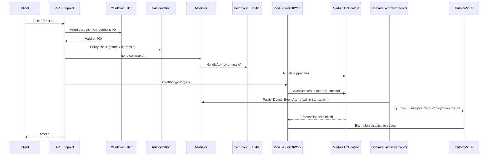
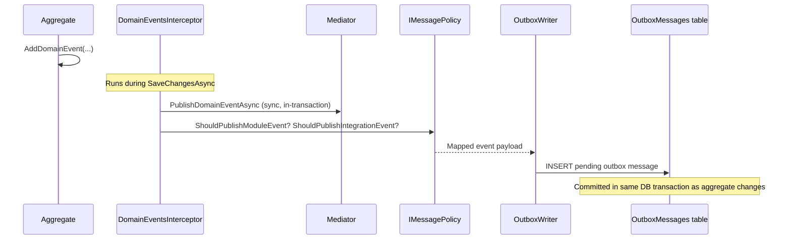
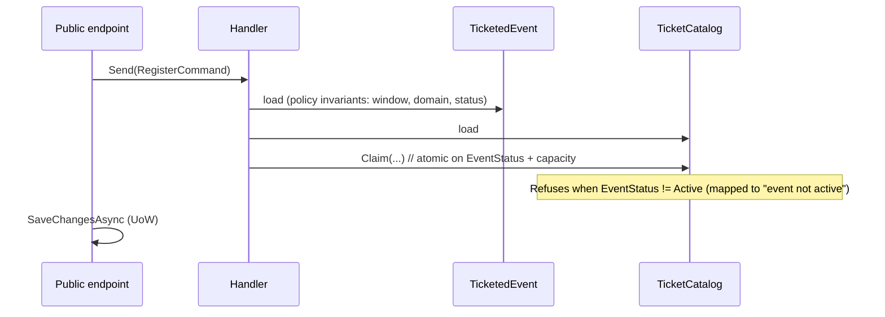
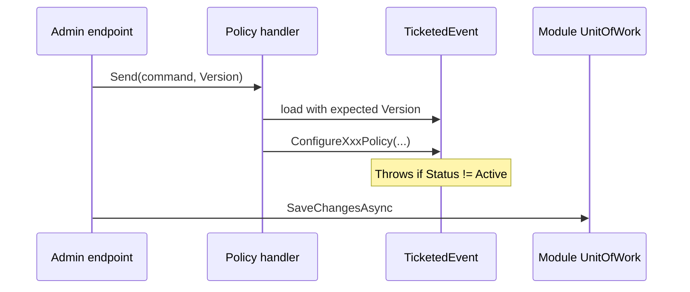
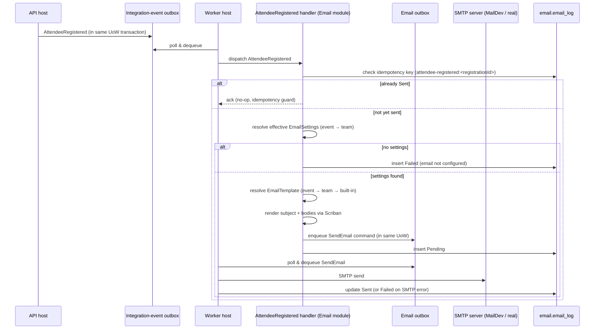

# 6. Runtime view

## 6.1 Admin command flow (write path)

This is the most important flow — it shows how a write request moves through validation, authorization, command handling, persistence, and outbox dispatch.



Key invariant: the **endpoint** calls `SaveChangesAsync`, not the handler. Handlers mutate state but never commit.

## 6.2 Domain event to outbox flow

Shows how a domain event raised inside an aggregate ends up as a queued message.



Message type naming: module events use `{module}.{event-name}` (e.g. `organization.user-created`); integration events use `integration.{module}.{event-name}`.

## 6.3 Cross-module query

Modules never access each other's DbContext. Instead, the consuming module calls a facade defined in the provider's Contracts project.

Example: Registrations module needs ticket types from Organization.

1. `RegisterAttendeeHandler` calls `IOrganizationFacade.GetTicketTypesAsync(eventId)`
2. `OrganizationFacade` dispatches `GetTicketTypesQuery` via `IMediator`
3. Handler queries `OrganizationDbContext` and returns `TicketTypeDto[]`
4. Optional `CachingOrganizationFacade` decorator caches repeated lookups

The same facade is used by authorization handlers to resolve team membership roles.

## 6.4 Event creation (Organization → Registrations async flow)

Event creation is a two-phase async flow. Organization validates team-level invariants and acts as the creation **gatekeeper**; Registrations materialises the authoritative `TicketedEvent` and reports back with an outcome. The Admin UI submits the request and polls a creation-status endpoint until it sees a terminal state.

```mermaid
sequenceDiagram
  participant UI as Admin UI
  participant OrgEp as Organization endpoint
  participant Team as Team aggregate
  participant OrgOutbox as Org outbox
  participant RegHandler as Registrations integration-event handler
  participant RegEvent as TicketedEvent aggregate
  participant Catalog as TicketCatalog
  participant RegOutbox as Reg outbox
  participant OrgHandler as Organization integration-event handler

  UI->>OrgEp: POST /admin/teams/{teamSlug}/events
  OrgEp->>Team: RequestCreation(slug, requester)
  Team->>Team: EnsureNotArchived(); PendingEventCount++
  Team->>Team: Add TeamEventCreationRequest (Pending)
  OrgEp->>OrgOutbox: TicketedEventCreationRequested (CreationRequestId, TeamId, Slug)
  OrgEp-->>UI: 202 Accepted + Location: /admin/teams/{slug}/event-creations/{id}
  OrgOutbox->>RegHandler: deliver
  RegHandler->>RegEvent: insert TicketedEvent (TeamId, Slug, ...)
  alt success
    RegHandler->>Catalog: create Active TicketCatalog
    RegHandler->>RegOutbox: TicketedEventCreated
  else duplicate slug
    RegHandler->>RegOutbox: TicketedEventCreationRejected (reason=duplicate_slug)
  end
  RegOutbox->>OrgHandler: deliver (idempotent on CreationRequestId)
  OrgHandler->>Team: RegisterEventCreated / RegisterEventRejected
  Team->>Team: PendingEventCount--; Active/Rejected counter++
  UI->>OrgEp: GET /admin/teams/{slug}/event-creations/{id} (poll)
  OrgEp-->>UI: { status: Created | Rejected | Pending, link }
```

Key properties:

- Organization owns `PendingEventCount` and the `TeamEventCreationRequest` state; these are mutated in the same unit of work as the outbox write.
- `CreationRequestId` is the idempotency key on every response event. Organization handlers are idempotent on redelivery and also tolerate out-of-order arrival of `TicketedEventCreated` vs the original request's own commit.
- A Quartz job (`ExpireStaleEventCreationRequestsJob`) expires `Pending` requests older than a configurable timeout and rolls back `PendingEventCount`, so team-archive is never blocked indefinitely by lost or unprocessable requests.

## 6.5 Event cancel / archive (Registrations → Organization)

`Cancel` and `Archive` operations target the authoritative `TicketedEvent` aggregate in Registrations. The lifecycle transition is projected atomically onto `TicketCatalog.EventStatus` (via an in-module domain event in the same unit of work), and propagated to Organization as an integration event so the team's counters can be updated.

```mermaid
sequenceDiagram
  participant UI as Admin UI
  participant RegEp as Registrations endpoint
  participant Event as TicketedEvent
  participant Catalog as TicketCatalog
  participant RegOutbox as Reg outbox
  participant OrgHandler as Organization integration-event handler
  participant Team

  UI->>RegEp: POST /admin/.../events/{eventSlug}/cancel (or /archive)
  RegEp->>Event: Cancel() / Archive()
  Event-->>Event: raises TicketedEventStatusChanged (in-module)
  Event->>Catalog: project EventStatus (same UoW)
  RegEp->>RegOutbox: TicketedEventCancelled / TicketedEventArchived (same UoW)
  RegOutbox->>OrgHandler: deliver (idempotent on TicketedEventId + transition)
  OrgHandler->>Team: RegisterEventCancelled / RegisterEventArchived
  Team->>Team: ActiveEventCount-- ; CancelledEventCount++ (or Archived++)
```

Because `TicketCatalog.EventStatus` is updated in the same transaction as `TicketedEvent.Cancel/Archive`, any in-flight registration that has already loaded `TicketCatalog` at a prior version fails its claim with a `DbUpdateConcurrencyException` — no registration can slip past a lifecycle transition.

## 6.6 Attendee registration (atomic status + capacity gate)

The registration handler (self-service or coupon) loads both `TicketedEvent` (for window / domain / active-status policy checks) and `TicketCatalog` (for the atomic claim) in the same unit of work.



Coupons bypass capacity / window / domain checks but do not bypass the active-status gate.

## 6.7 Policy mutation flow

Policy commands (`ConfigureRegistrationPolicyCommand`, `ConfigureCancellationPolicyCommand`, `ConfigureReconfirmPolicyCommand`) load the `TicketedEvent` aggregate and call the matching policy mutator directly. Each mutator refuses when the event's status is not Active, so there is no separate lifecycle guard. Optimistic concurrency is supplied by `TicketedEvent.Version`.



## 6.8 Registration-confirmation email flow

When an attendee registers successfully, the API handler emits an `AttendeeRegistered` integration event via the outbox. The Worker picks it up and attempts to send a confirmation email.



**Idempotency**: the `EmailLog` row with key `attendee-registered:<registrationId>` is checked before every send attempt. A re-delivered integration event that already produced a `Sent` log row is acked without a second send.

**Degraded mode**: if no effective email settings exist for the event, a `Failed` log row is written with reason "email not configured" and the integration event is still acked — registration itself is unaffected.

## Done-when

- [x] The most important end-to-end flow is documented.
- [x] Each scenario has a diagram and a short narrative.
- [ ] Error paths and degraded modes are noted where they matter.
