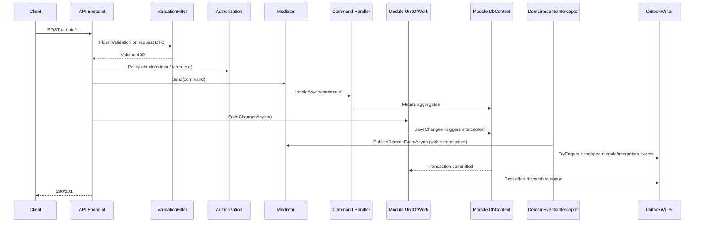
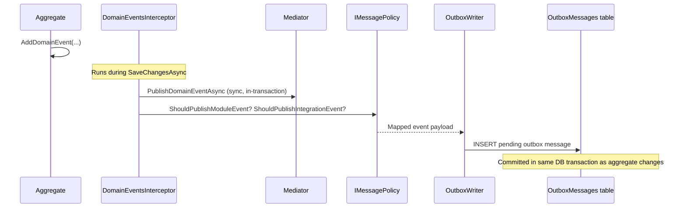

# 6. Runtime view

## 6.1 Admin command flow (write path)

This is the most important flow — it shows how a write request moves through validation, authorization, command handling, persistence, and outbox dispatch.

Key invariant: the **endpoint** calls `SaveChangesAsync`, not the handler. Handlers mutate state but never commit.

## 6.2 Domain event to outbox flow

Shows how a domain event raised inside an aggregate ends up as a queued message.

Message type naming: module events use `{module}.{event-name}` (e.g. `organization.user-created`); integration events use `integration.{module}.{event-name}`.

## 6.3 Cross-module query

Modules never access each other's DbContext. Instead, the consuming module calls a facade defined in the provider's Contracts project.

Example: Registrations module needs ticket types from Organization.

1. `RegisterAttendeeHandler` calls `IOrganizationFacade.GetTicketTypesAsync(eventId)`
2. `OrganizationFacade` dispatches `GetTicketTypesQuery` via `IMediator`
3. Handler queries `OrganizationDbContext` and returns `TicketTypeDto[]`
4. Optional `CachingOrganizationFacade` decorator caches repeated lookups

The same facade is used by authorization handlers to resolve team membership roles.

## Done-when

- [x] The most important end-to-end flow is documented.
- [x] Each scenario has a diagram and a short narrative.
- [ ] Error paths and degraded modes are noted where they matter.
