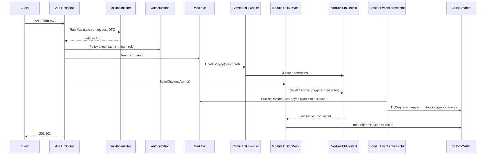
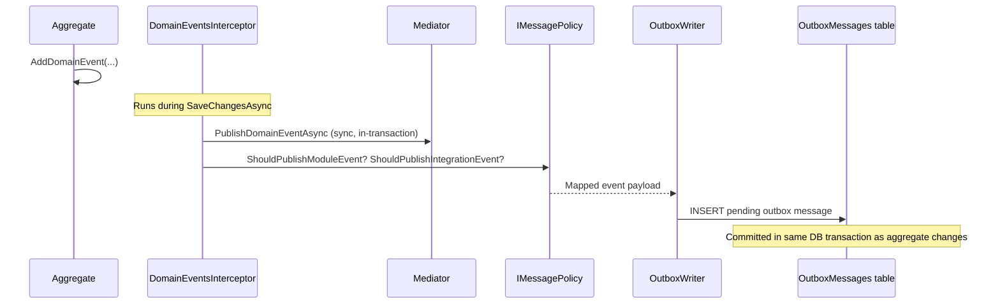
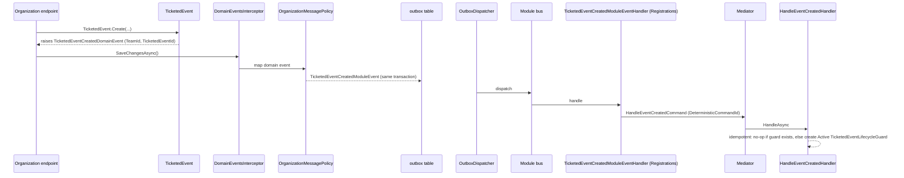

# 6. Runtime view

## 6.1 Admin command flow (write path)

This is the most important flow — it shows how a write request moves through validation, authorization, command handling, persistence, and outbox dispatch.



Key invariant: the **endpoint** calls `SaveChangesAsync`, not the handler. Handlers mutate state but never commit.

## 6.2 Domain event to outbox flow

Shows how a domain event raised inside an aggregate ends up as a queued message.



Message type naming: module events use `{module}.{event-name}` (e.g. `organization.user-created`); integration events use `integration.{module}.{event-name}`.

## 6.3 Cross-module query

Modules never access each other's DbContext. Instead, the consuming module calls a facade defined in the provider's Contracts project.

Example: Registrations module needs ticket types from Organization.

1. `RegisterAttendeeHandler` calls `IOrganizationFacade.GetTicketTypesAsync(eventId)`
2. `OrganizationFacade` dispatches `GetTicketTypesQuery` via `IMediator`
3. Handler queries `OrganizationDbContext` and returns `TicketTypeDto[]`
4. Optional `CachingOrganizationFacade` decorator caches repeated lookups

The same facade is used by authorization handlers to resolve team membership roles.

## 6.4 Org → Registrations event-creation sync

When an organizer creates a `TicketedEvent`, the new event must also exist in the Registrations module so that policy operations (set registration window, manage ticket types, configure cancellation/reconfirm policies) can find it. This happens via the standard module-event pipeline — there is no shared transaction between modules.



The Created handler creates a `TicketedEventLifecycleGuard` (not a policy aggregate). Policy aggregates are created on demand when the operator configures them. Cancel and Archive follow the same shape, mapping `TicketedEventCancelledDomainEvent` / `TicketedEventArchivedDomainEvent` onto the corresponding module events — their handlers load-or-create the guard and set the lifecycle status (idempotent).

## 6.5 Policy mutation flow

Every command that mutates a policy aggregate (registration, cancellation, reconfirm, ticket types) follows the lifecycle guard pattern (see [§8.14](08-crosscutting-concepts.md#814-lifecycle-guard-pattern)):

```mermaid
sequenceDiagram
  participant Endpoint as Admin endpoint
  participant Mediator
  participant Handler as Policy handler
  participant Guard as TicketedEventLifecycleGuard
  participant PolicyAgg as Policy aggregate
  participant UoW as Module UnitOfWork

  Endpoint->>Mediator: Send(command)
  Mediator->>Handler: HandleAsync(command)
  Handler->>Guard: LoadOrCreate(eventId)
  Handler->>Guard: AssertActiveAndRegisterPolicyMutation()
  Note over Guard: Throws if not Active; bumps PolicyMutationCount++
  Handler->>PolicyAgg: Create or update policy
  Endpoint->>UoW: SaveChangesAsync()
  Note over UoW: Guard row version advances → concurrent lifecycle event conflicts
```

Because `PolicyMutationCount++` writes the guard row, EF advances `Version`. A concurrent lifecycle handler that loaded the same guard will fail with a `DbUpdateConcurrencyException`, ensuring strong consistency between policy edits and lifecycle transitions.

## Done-when

- [x] The most important end-to-end flow is documented.
- [x] Each scenario has a diagram and a short narrative.
- [ ] Error paths and degraded modes are noted where they matter.
