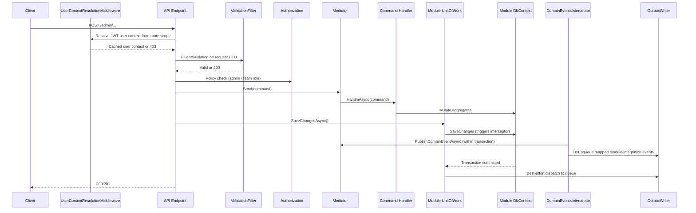
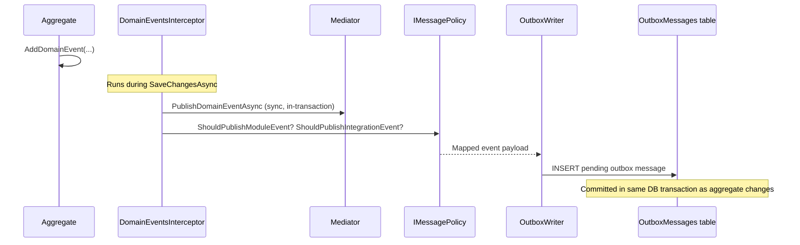
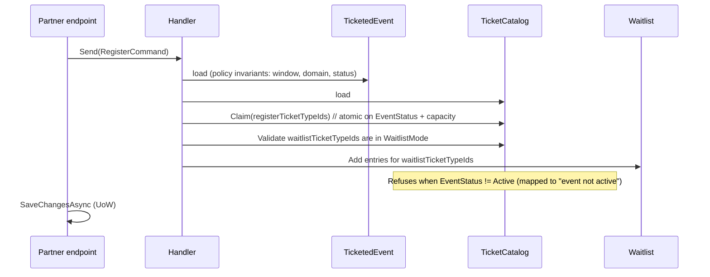
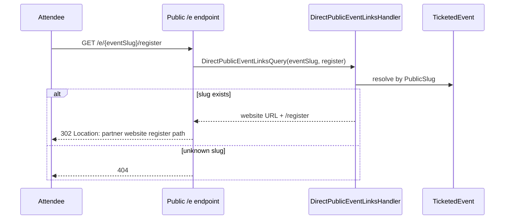
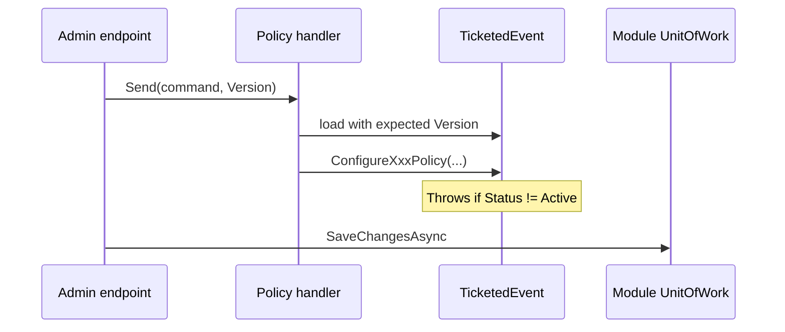
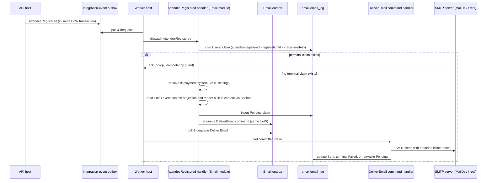
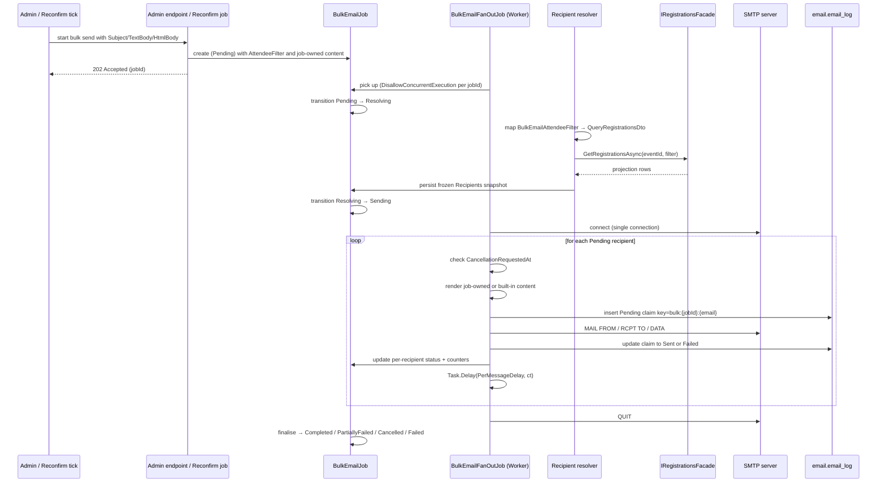
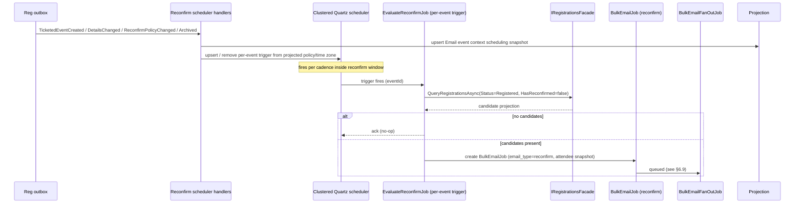
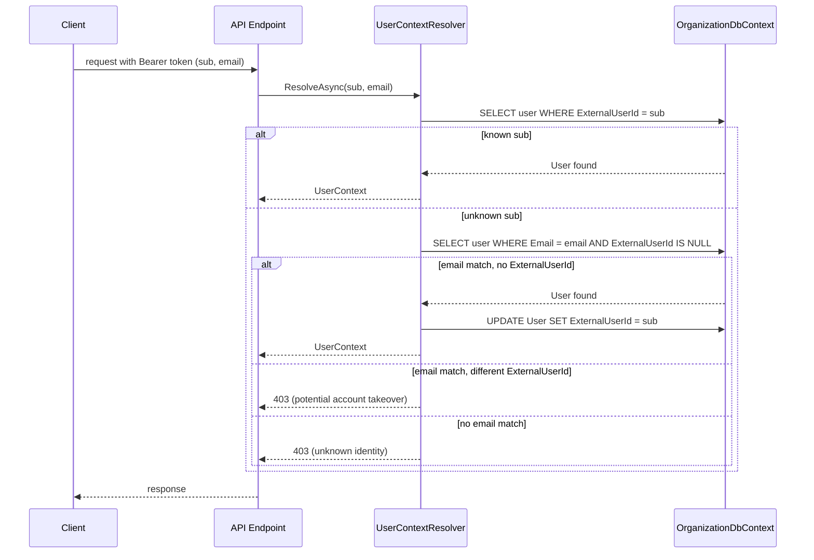
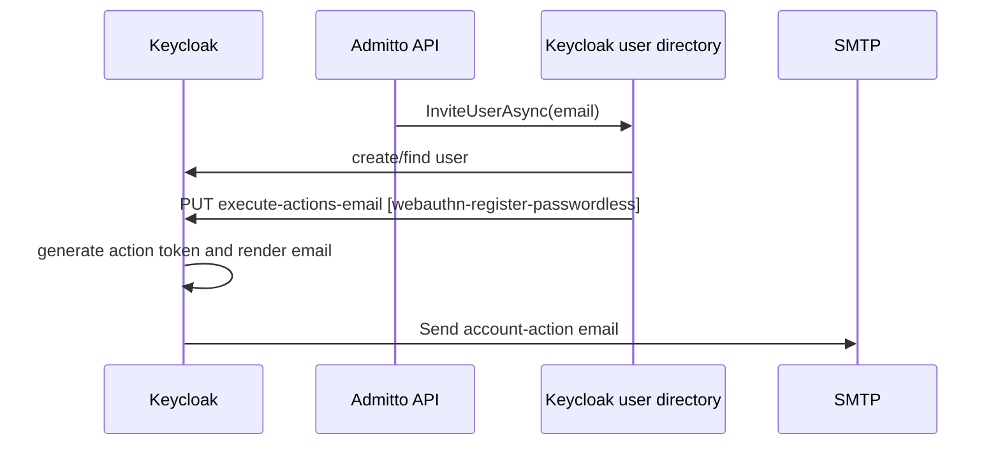

# 6. Runtime view

## 6.1 Admin command flow (write path)

This is the most important flow — it shows how a write request moves through validation, authorization, command handling, persistence, and outbox dispatch.

```mermaid
sequenceDiagram
  participant Client
  participant Context as UserContextResolutionMiddleware
  participant Endpoint as API Endpoint
  participant Filter as ValidationFilter
  participant Auth as Authorization
  participant Mediator
  participant Handler as Command Handler
  participant UoW as Module UnitOfWork
  participant DbCtx as Module DbContext
  participant Interceptor as DomainEventsInterceptor
  participant Outbox as OutboxWriter

  Client->>Endpoint: POST /admin/...
  Endpoint->>Context: Resolve JWT user context from route scope
  Context-->>Endpoint: Cached user context or 403
  Endpoint->>Filter: FluentValidation on request DTO
  Filter-->>Endpoint: Valid or 400
  Endpoint->>Auth: Policy check (admin / team role)
  Endpoint->>Mediator: Send(command)
  Mediator->>Handler: HandleAsync(command)
  Handler->>DbCtx: Mutate aggregates
  Endpoint->>UoW: SaveChangesAsync()
  UoW->>DbCtx: SaveChanges (triggers interceptor)
  Interceptor->>Mediator: PublishDomainEventAsync (within transaction)
  Interceptor->>Outbox: TryEnqueue mapped module/integration events
  DbCtx-->>UoW: Transaction committed
  UoW->>Outbox: Best-effort dispatch to queue
  Endpoint-->>Client: 200/201
```

Key invariant: the **endpoint** calls `SaveChangesAsync`, not the handler. Handlers mutate state but never commit.

## 6.2 Domain event to outbox flow

Shows how a domain event raised inside an aggregate ends up as a queued message.

```mermaid
sequenceDiagram
  participant Aggregate
  participant Interceptor as DomainEventsInterceptor
  participant Mediator
  participant Policy as IMessagePolicy
  participant Writer as OutboxWriter
  participant Table as OutboxMessages table

  Aggregate->>Aggregate: AddDomainEvent(...)
  Note over Interceptor: Runs during SaveChangesAsync
  Interceptor->>Mediator: PublishDomainEventAsync (sync, in-transaction)
  Interceptor->>Policy: ShouldPublishModuleEvent? ShouldPublishIntegrationEvent?
  Policy-->>Writer: Mapped event payload
  Writer->>Table: INSERT pending outbox message
  Note over Table: Committed in same DB transaction as aggregate changes
```

Message type naming: module events use `{module}.{event-name}` (e.g. `organization.user-created`); integration events use `integration.{module}.{event-name}`.

Pending outbox rows are not lost when the immediate post-commit dispatch fails. The Worker host runs a bounded retry scanner for every module DbContext that implements `IOutboxDbContext`: it reads `Pending` rows older than the configured retry minimum age, sends them to the queue, and marks them `Sent` after a successful queue send. The age gate avoids racing the same unit of work's immediate post-commit dispatch. Multiple Worker instances may still race and produce duplicate queue deliveries if a send succeeds but marking `Sent` fails; downstream handlers must remain idempotent.

## 6.3 Cross-module query

Modules never access each other's DbContext. Instead, the consuming module calls a facade defined in the provider's Contracts project.

Example: Registrations module needs ticket types from Organization.

1. `RegisterAttendeeHandler` calls `IOrganizationFacade.GetTicketTypesAsync(eventId)`
2. `OrganizationFacade` dispatches `GetTicketTypesQuery` via `IMediator`
3. Handler queries `OrganizationDbContext` and returns `TicketTypeDto[]`
4. Optional `CachingOrganizationFacade` decorator caches repeated lookups

The same facade is used by authorization handlers to resolve team membership roles.

## 6.4 Event creation (Organization → Registrations async flow)

Event creation is a two-phase async flow. Organization validates team-level invariants and acts as the creation **gatekeeper**; Registrations materialises the authoritative `TicketedEvent` and reports back with an outcome. The Admin UI submits the request and polls a creation-status endpoint until it sees a terminal state.

```mermaid
sequenceDiagram
  participant UI as Admin UI
  participant OrgEp as Organization endpoint
  participant Team as Team aggregate
  participant OrgOutbox as Org outbox
  participant RegHandler as Registrations integration-event handler
  participant RegEvent as TicketedEvent aggregate
  participant Catalog as TicketCatalog
  participant RegOutbox as Reg outbox
  participant OrgHandler as Organization integration-event handler

  UI->>OrgEp: POST /admin/teams/{teamId}/events
  OrgEp->>Team: RequestCreation(requester)
  Team->>Team: EnsureNotArchived(); PendingEventCount++
  Team->>Team: Add TeamEventCreationRequest (Pending)
  OrgEp->>OrgOutbox: TicketedEventCreationRequested (CreationRequestId, TeamId, ...)
  OrgEp-->>UI: 202 Accepted + Location: /admin/teams/{teamId}/event-creations/{id}
  OrgOutbox->>RegHandler: deliver
  RegHandler->>RegEvent: insert TicketedEvent (TeamId, ...)
  alt success
    RegHandler->>Catalog: create Active TicketCatalog
    RegHandler->>RegOutbox: TicketedEventCreated
  else failure
    RegHandler->>RegOutbox: TicketedEventCreationRejected
  end
  RegOutbox->>OrgHandler: deliver (idempotent on CreationRequestId)
  OrgHandler->>Team: RegisterEventCreated / RegisterEventRejected
  Team->>Team: PendingEventCount--; Active/Rejected counter++
  UI->>OrgEp: GET /admin/teams/{teamId}/event-creations/{id} (poll)
  OrgEp-->>UI: { status: Created | Rejected | Pending, link }
```

Key properties:

- Organization owns `PendingEventCount` and the `TeamEventCreationRequest` state; these are mutated in the same unit of work as the outbox write.
- `CreationRequestId` is the idempotency key on every response event. Organization handlers are idempotent on redelivery and also tolerate out-of-order arrival of `TicketedEventCreated` vs the original request's own commit.
- A Quartz job (`ExpireStaleEventCreationRequestsJob`) expires `Pending` requests older than a configurable timeout and rolls back `PendingEventCount`, so team-archive is never blocked indefinitely by lost or unprocessable requests.

## 6.5 Event archive (Registrations → Organization)

`Archive` targets the authoritative `TicketedEvent` aggregate in Registrations. The lifecycle transition is projected atomically onto `TicketCatalog.EventStatus` (via an in-module domain event in the same unit of work), and propagated to Organization as an integration event so the team's counters can be updated.

```mermaid
sequenceDiagram
  participant UI as Admin UI
  participant RegEp as Registrations endpoint
  participant Event as TicketedEvent
  participant Catalog as TicketCatalog
  participant RegOutbox as Reg outbox
  participant OrgHandler as Organization integration-event handler
  participant Team

  UI->>RegEp: POST /admin/.../events/{eventSlug}/archive
  RegEp->>Event: Archive()
  Event-->>Event: raises TicketedEventStatusChanged (in-module)
  Event->>Catalog: project EventStatus (same UoW)
  RegEp->>RegOutbox: TicketedEventArchived (same UoW)
  RegOutbox->>OrgHandler: deliver (idempotent on TicketedEventId + transition)
  OrgHandler->>Team: RegisterEventArchived
  Team->>Team: ActiveEventCount-- ; ArchivedEventCount++
```

Because `TicketCatalog.EventStatus` is updated in the same transaction as `TicketedEvent.Archive`, any in-flight registration that has already loaded `TicketCatalog` at a prior version fails its claim with a `DbUpdateConcurrencyException` — no registration can slip past a lifecycle transition.

## 6.6 Partner attendee registration and waitlist submission (atomic status + capacity gate)

Partner attendee endpoints are mounted under `/api/events/{eventSlug}/...` and require `X-Api-Key`. API-key authentication resolves the owning team into a `team_id` claim, and partner endpoints derive `TeamId` from that claim rather than from the URL. Endpoint code resolves `TicketedEvent.PublicSlug` within the API-key owner's team scope before dispatching handlers. Handlers still receive both `TeamId` and `TicketedEventId`, so event/resource lookups remain scoped to the API key owner's team and a valid key for another team receives the normal not-found behavior.

The registration handler (self-service or coupon) loads both `TicketedEvent` (for window / domain / schema policy checks) and `TicketCatalog` (for the active-status and atomic capacity claim) in the same unit of work. Public self-service registration accepts explicit `registerTicketTypeIds` and `waitlistTicketTypeIds`; capacity is claimed only for registration tickets, while waitlist entries are created for waitlist tickets in the same transaction.

```mermaid
sequenceDiagram
  participant Endpoint as Partner endpoint
  participant Handler
  participant Event as TicketedEvent
  participant Catalog as TicketCatalog

  Endpoint->>Handler: Send(RegisterCommand)
  Handler->>Event: load (policy invariants: window, domain, status)
  Handler->>Catalog: load
  Handler->>Catalog: Claim(registerTicketTypeIds)  // atomic on EventStatus + capacity
  Handler->>Catalog: Validate waitlistTicketTypeIds are in WaitlistMode
  Handler->>Waitlist: Add entries for waitlistTicketTypeIds
  Note over Catalog: Refuses when EventStatus != Active (mapped to "event not active")
  Endpoint->>Endpoint: SaveChangesAsync (UoW)
```

Waitlist-only submissions create waitlist entries without creating a `Registration`; the partner response reports `registrationId = null` and the waitlisted ticket ids. After the email-verification token is accepted and terminal event/window/domain/detail guards pass, self-service registration classifies submitted register/waitlist ticket IDs against the current `TicketCatalog` before mutating capacity or waitlists. Recoverable ticket-selection mismatches return a 409 `registration.ticket_state_conflict` problem response with grouped submitted IDs (`registerableTicketTypeIds`, `waitlistableTicketTypeIds`, `unavailableTicketTypeIds`, `unknownTicketTypeIds`, `invalidForRequestedActionTicketTypeIds`) and persist no partial registration, waitlist entry, or capacity change. Coupons bypass capacity / window / domain checks but do not bypass the active-status gate.

Existing attendee registrations are updated through `PUT /api/events/{eventSlug}/registrations/{registrationId}`. This Partner API call derives team scope from `X-Api-Key`, resolves the event slug within that team, and treats `registrationId` as the registration bearer credential. Partner sites that only have the attendee's verified email can first call `GET /api/events/{eventSlug}/registrations/resolve?email=...`; this requires the same `X-Api-Key` plus an email-verification bearer token whose embedded email matches the query email, and returns only the matching `registrationId`. The update request replaces the attendee-editable registration state: first name, last name, additional details, and the final registered ticket set. The handler validates the active event, registration window, additional-detail schema, final ticket set, and optional waitlist coupon before persisting attendee details and capacity deltas in one Registrations unit of work. Waitlist coupons can be applied as a capacity grant for the offered ticket type only; the final registered ticket set is still validated for duplicates, unknown ticket types, and overlapping time slots. Ticket-change side effects are emitted only when the final ticket selection differs from the current selection, so details-only edits do not send ticket-change confirmation email.

## 6.6.1 Anonymous public event links

Anonymous Public API routes are mounted under `/e/{eventSlug}`. They resolve `TicketedEvent.PublicSlug` and never accept request-controlled redirect targets. The canonical event route redirects to the stored event website URL; action routes append website-relative paths while preserving any existing path prefix on the stored website URL.

```mermaid
sequenceDiagram
  participant Attendee
  participant Endpoint as Public /e endpoint
  participant Handler as DirectPublicEventLinksHandler
  participant Event as TicketedEvent

  Attendee->>Endpoint: GET /e/{eventSlug}/register
  Endpoint->>Handler: DirectPublicEventLinksQuery(eventSlug, register)
  Handler->>Event: resolve by PublicSlug
  alt slug exists
    Handler-->>Endpoint: website URL + /register
    Endpoint-->>Attendee: 302 Location: partner website register path
  else unknown slug
    Endpoint-->>Attendee: 404
  end
```

`/e/{eventSlug}/cancel/{registrationId}` and `/e/{eventSlug}/edit/{registrationId}` follow the same lookup path and append `cancel/{registrationId}` or `edit/{registrationId}`. Query-string values such as `redirect=` are ignored.

## 6.6.2 Anonymous public QR-code retrieval

QR-code retrieval is exposed only as `GET /e/{eventSlug}/qr-code/{registrationId}`. The handler resolves the event by public slug, then loads the registration by `(eventId, registrationId)`, and returns a PNG whose payload is the literal registration ID. Cancelled registrations still resolve; QR-code revocation is not part of this flow.

The previous Partner API route `GET /api/events/{eventId}/registrations/{registrationId}/qr-code` is no longer exposed.

## 6.7 Policy mutation flow

Policy commands (`ConfigureRegistrationPolicyCommand`, `ConfigureReconfirmPolicyCommand`, `ConfigureWaitlistPolicyCommand`) load the `TicketedEvent` aggregate and call the matching policy mutator directly. Each mutator refuses when the event's status is not Active, so there is no separate lifecycle guard. Optimistic concurrency is supplied by `TicketedEvent.Version`.

```mermaid
sequenceDiagram
  participant Endpoint as Admin endpoint
  participant Handler as Policy handler
  participant Event as TicketedEvent
  participant UoW as Module UnitOfWork

  Endpoint->>Handler: Send(command, Version)
  Handler->>Event: load with expected Version
  Handler->>Event: ConfigureXxxPolicy(...)
  Note over Event: Throws if Status != Active
  Endpoint->>UoW: SaveChangesAsync
```

## 6.8 Registration-confirmation email flow

When an attendee registers successfully, the API handler emits an `AttendeeRegistered` integration event via the outbox. The Worker picks it up and prepares durable e-mail delivery work. SMTP is attempted only after the Email module has committed an `EmailLog` claim and an internal delivery command.

```mermaid
sequenceDiagram
    participant Api as API host
    participant Outbox as Integration-event outbox
    participant Worker as Worker host
    participant EmailHandler as AttendeeRegistered handler (Email module)
    participant EmailOutbox as Email outbox
    participant EmailLog as email.email_log
    participant Delivery as DeliverEmail command handler
    participant SMTP as SMTP server (MailDev / real)

    Api->>Outbox: AttendeeRegistered (in same UoW transaction)
    Worker->>Outbox: poll & dequeue
    Worker->>EmailHandler: dispatch AttendeeRegistered
    EmailHandler->>EmailLog: check send claim (attendee-registered:<registrationId>:<registeredAt>)
    alt terminal claim exists
        EmailHandler-->>Worker: ack (no-op, idempotency guard)
    else no terminal claim exists
        EmailHandler->>EmailHandler: resolve deployment system SMTP settings
    EmailHandler->>EmailHandler: read Email event context projection and render built-in content via Scriban
        EmailHandler->>EmailLog: insert Pending claim
        EmailHandler->>EmailOutbox: enqueue DeliverEmail command (same UoW)
        Worker->>EmailOutbox: poll & dequeue DeliverEmail
        Worker->>Delivery: load committed claim
        Delivery->>SMTP: SMTP send with bounded inline retries
        Delivery->>EmailLog: update Sent, terminal Failed, or retryable Pending
    end
```

**Idempotency**: the `EmailLog` row with key `attendee-registered:<registrationId>:<registeredAt>` is the send claim. A re-delivered integration event that observes a terminal claim is acked without another SMTP attempt; a pending claim can enqueue delivery again for recovery. SMTP itself is not transactional, so rare duplicate delivery races or a crash after SMTP success but before updating the log can still produce a later duplicate during recovery.

Admin and Partner ticket-confirmation resends are requested through Registrations-owned endpoints. The API validates the scoped registration, writes a Registrations outbox message carrying the resend snapshot, and returns `202 Accepted`. Partner requests derive the team scope from the API-key principal and resolve the event slug within that team before dispatching the shared resend command. The Worker delivers `TicketConfirmationResendRequestedIntegrationEvent` to the Email module, which then uses the normal `SendEmailCommand` claim/render/outbox pipeline with idempotency key `ticket-confirmation-resend:<registrationId>:<resendRequestId>`. SMTP delivery remains Worker-only through `DeliverEmailCommand`; the API host neither creates EmailLog claims nor opens SMTP connections.

**Configuration failure**: if deployment system SMTP settings are missing or invalid, registration itself is unaffected. The email work records the failure through the normal `EmailLog`/delivery-error path and operator telemetry; this is an operability issue, not team-owned event state. Transient SMTP failures remain retryable until the configured delivery attempt limit is reached.

## 6.9 Bulk-email fan-out (single SMTP connection)

When an admin starts a bulk send (or the reconfirm scheduler ticks), a `BulkEmailJob` is created in `Pending` state and a Quartz trigger queues `BulkEmailFanOutJob`. The fan-out job opens **one** SMTP connection per pickup and streams every recipient through it; the single-send pipeline is bypassed deliberately to avoid one TLS handshake per recipient.

```mermaid
sequenceDiagram
    participant Admin as Admin / Reconfirm tick
    participant Endpoint as Admin endpoint / Reconfirm job
    participant Job as BulkEmailJob
    participant FanOut as BulkEmailFanOutJob (Worker)
    participant Resolver as Recipient resolver
    participant Facade as IRegistrationsFacade
    participant SMTP as SMTP server
    participant EmailLog as email.email_log

    Admin->>Endpoint: start bulk send with Subject/TextBody/HtmlBody
    Endpoint->>Job: create (Pending) with AttendeeFilter and job-owned content
    Endpoint-->>Admin: 202 Accepted (jobId)
    FanOut->>Job: pick up (DisallowConcurrentExecution per jobId)
    Job->>Job: transition Pending → Resolving
    Resolver->>Resolver: map BulkEmailAttendeeFilter → QueryRegistrationsDto
    Resolver->>Facade: GetRegistrationsAsync(eventId, filter)
    Facade-->>Resolver: projection rows
    Resolver->>Job: persist frozen Recipients snapshot
    Job->>Job: transition Resolving → Sending
    FanOut->>SMTP: connect (single connection)
    loop for each Pending recipient
      FanOut->>FanOut: check CancellationRequestedAt
      FanOut->>FanOut: render job-owned or built-in content
      FanOut->>EmailLog: insert Pending claim key=bulk:{jobId}:{email}
      FanOut->>SMTP: MAIL FROM / RCPT TO / DATA
      FanOut->>EmailLog: update claim to Sent or Failed
      FanOut->>Job: update per-recipient status + counters
      FanOut->>FanOut: Task.Delay(PerMessageDelay, ct)
    end
    FanOut->>SMTP: QUIT
    Job->>Job: finalise → Completed / PartiallyFailed / Cancelled / Failed
```

**Resume-after-crash**: only `Pending` rows on the snapshot are picked up on the next run; per-recipient `EmailLog` uniqueness on `(ticketed_event_id, recipient, idempotency_key)` is the database-backed claim that prevents pre-existing terminal recipient logs from sending again.

**Recipient source**: bulk email targets registered attendees only. The job persists an Email-owned `BulkEmailAttendeeFilter`; the resolver maps it to the Registrations `QueryRegistrationsDto` contract at the facade-call boundary, so the query contract is never part of Email's durable state. There is no external/CSV source.

**Cancellation**: `POST /admin/.../bulk-emails/{id}/cancel` sets `CancellationRequestedAt` on the aggregate; the worker observes it between recipients and during the per-message delay, transitions remaining `Pending` rows to `Cancelled`, and closes the SMTP session cleanly.

## 6.10 Reconfirm scheduling (per-event Quartz trigger)

The Email module owns one static Quartz job (`EvaluateReconfirmJob`) and registers a per-event trigger whose cron is derived from `TicketedEventReconfirmPolicy` and evaluated in `TicketedEvent.TimeZone`. Triggers are kept in sync with Registrations through integration events.

```mermaid
sequenceDiagram
    participant RegOutbox as Reg outbox
    participant ReconfirmHandlers as Reconfirm scheduler handlers
    participant Quartz as Clustered Quartz scheduler
    participant Eval as EvaluateReconfirmJob (per-event trigger)
    participant Facade as IRegistrationsFacade
    participant Job as BulkEmailJob (reconfirm)
    participant FanOut as BulkEmailFanOutJob

    RegOutbox->>ReconfirmHandlers: TicketedEventCreated / DetailsChanged / ReconfirmPolicyChanged / Archived
    ReconfirmHandlers->>Projection: upsert Email event context scheduling snapshot
    ReconfirmHandlers->>Quartz: upsert / remove per-event trigger from projected policy/time zone
    Note over Quartz: fires per cadence inside reconfirm window
    Quartz->>Eval: trigger fires (eventId)
    Eval->>Facade: QueryRegistrationsAsync(Status=Registered, HasReconfirmed=false)
    Facade-->>Eval: candidate projection
    alt no candidates
      Eval-->>Quartz: ack (no-op)
    else candidates present
      Eval->>Job: create BulkEmailJob (email_type=reconfirm, attendee snapshot)
      Job->>FanOut: queued (see §6.9)
    end
```

**Eligibility**: live `HasReconfirmed=false` is the only gate — no extra `email_log` cadence filter. The cron *is* the cadence; tightening the policy (e.g. 7d → 3d) immediately changes prompt frequency.

**Lifecycle cleanup**: `TicketedEventArchived` integration events mark the Email projection archived and remove the trigger so archived events stop receiving reconfirm prompts.

**Projection consistency**: Email rendering and scheduling use the latest `email.event_email_context_view` row available when the worker handles a message. Recent Organization/Registrations edits may lag by queue delivery time; this staleness is accepted for email rendering and does not affect registration correctness.

**Clustering**: Quartz uses the PostgreSQL-backed store in `quartz-db` with clustering enabled. API handlers can persist schedules, while Worker instances host the scheduler and execute jobs. During rolling deployments or temporary Worker scale-out, Quartz acquires each trigger on only one live scheduler instance.

## 6.11 User sign-in and ExternalUserId binding

In production, Admin UI users authenticate through Keycloak's hosted passkey-only browser flow. The production browser flow starts directly at WebAuthn passwordless authentication, so users are prompted by the browser/passkey provider rather than entering an email address first. Keycloak performs the WebAuthn assertion ceremony and returns OIDC tokens to the Admin UI; Admitto never handles passkey material or WebAuthn challenge/response details. Keycloak's account-console client is disabled so authenticated users cannot use the standalone Keycloak account UI for profile or credential management. Local development intentionally uses a separate Keycloak realm where the first screen remains the standard username/password form with a passkey alternative, and end-to-end tests keep test-only direct-grant clients so automation remains offline and repeatable.

On every authenticated request the `UserContextResolver` maps the incoming JWT `sub` claim to an application `User` entity. The binding is established lazily on first sign-in and is permanent thereafter.

```mermaid
sequenceDiagram
  participant Client
  participant API as API Endpoint
  participant Resolver as UserContextResolver
  participant DB as OrganizationDbContext

  Client->>API: request with Bearer token (sub, email)
  API->>Resolver: ResolveAsync(sub, email)
  Resolver->>DB: SELECT user WHERE ExternalUserId = sub
  alt known sub
    DB-->>Resolver: User found
    Resolver-->>API: UserContext
  else unknown sub
    Resolver->>DB: SELECT user WHERE Email = email AND ExternalUserId IS NULL
    alt email match, no ExternalUserId
      DB-->>Resolver: User found
      Resolver->>DB: UPDATE User SET ExternalUserId = sub
      Resolver-->>API: UserContext
    else email match, different ExternalUserId
      Resolver-->>API: 403 (potential account takeover)
    else no email match
      Resolver-->>API: 403 (unknown identity)
    end
  end
  API-->>Client: response
```

**First sign-in**: the JWT arrives with a `sub` the system has not seen before. `UserContextResolver` falls back to an email lookup. If the email matches a `User` that has no `ExternalUserId` yet, the resolver sets `ExternalUserId = sub` and persists — all within the request's unit of work. Subsequent requests resolve directly by `ExternalUserId`.

**Account-takeover guard**: if the email matches a user that already has a *different* `ExternalUserId`, the resolver returns 403. This prevents a compromised or recycled IdP account from silently taking over an existing application user.

**Unknown identity**: if neither `sub` nor `email` matches any user, the resolver returns 403. The user must be provisioned before they can authenticate.

## 6.12 Bootstrap admin provisioning

On API startup, `BootstrapAdminInitializer` ensures the first admin account exists without requiring manual IdP console steps. Production bootstrap creates or reconciles the Admitto admin user, creates or finds the matching Keycloak user, and asks Keycloak to send a `webauthn-register-passwordless` execute-actions email through Keycloak's configured SMTP server. The action link leads the operator through Keycloak's passkey enrollment pages, not an Admitto-hosted WebAuthn flow. Local development keeps password-capable seeded users while also allowing passkey sign-in for users who enroll one.

1. Reads `Organization:BootstrapAdmin:EmailAddress` from configuration.
2. Queries `OrganizationDbContext` for a `User` with that email.
3. **If the user does not exist**: creates a `User` entity, calls `IExternalUserDirectory.InviteUserAsync` to create or find the Keycloak account and trigger passkey-enrollment when required, and stores the returned `ExternalUserId` on the entity.
4. **If the user already exists and has an `ExternalUserId`**: skips silently (idempotent).
5. **If the user exists but has no `ExternalUserId`**: calls `InviteUserAsync` and stores the result (handles the case where a previous startup run created the user but failed before persisting the `sub`).

The initialiser runs once per process start and is safe to run on every rolling deployment — repeated calls are no-ops when the bootstrap admin is already fully provisioned.

## 6.13 Keycloak account-action email

Keycloak owns account-action email rendering and SMTP delivery. Admitto provisions or reconciles the user through Keycloak's Admin API and then calls `execute-actions-email` with `client_id=admitto-ui` and the Admin UI public URL as the redirect target. Keycloak generates the action token, renders the account-action email with the Admitto email theme, and sends it through its configured SMTP server. The execute-actions copy is invitation-oriented and describes the user-facing passkey setup, not Keycloak required-action identifiers.

```mermaid
sequenceDiagram
  participant Keycloak
  participant Api as Admitto API
  participant Directory as Keycloak user directory
  participant SMTP

  Api->>Directory: InviteUserAsync(email)
  Directory->>Keycloak: create/find user
  Directory->>Keycloak: PUT execute-actions-email [webauthn-register-passwordless]
  Keycloak->>Keycloak: generate action token and render email
  Keycloak->>SMTP: Send account-action email
```

The Email module is not involved in this flow: no Admitto email integration event is published, no `EmailLog` row is written, and no Admitto template is rendered. Application-owned emails still use the Email module flows in §6.8-§6.10.

In Aspire run mode, the local realm keeps preprovisioned username/password users, shows the standard username/password form first with a passkey alternative, and points Keycloak SMTP at MailDev. Normal password sign-in does not send email. To verify the path locally, trigger a Keycloak execute-actions email such as `webauthn-register-passwordless`; Keycloak sends the final email to MailDev.

## Done-when

- [x] The most important end-to-end flow is documented.
- [x] Each scenario has a diagram and a short narrative.
- [ ] Error paths and degraded modes are noted where they matter.
