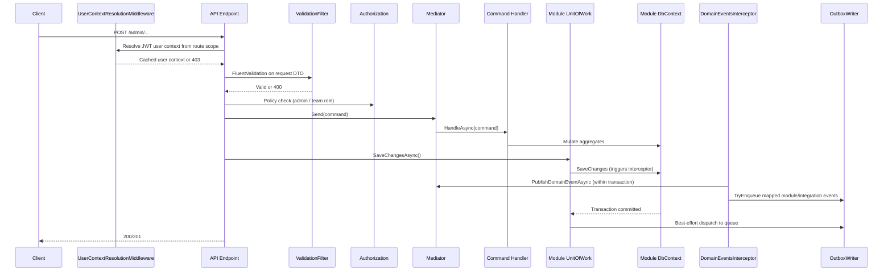
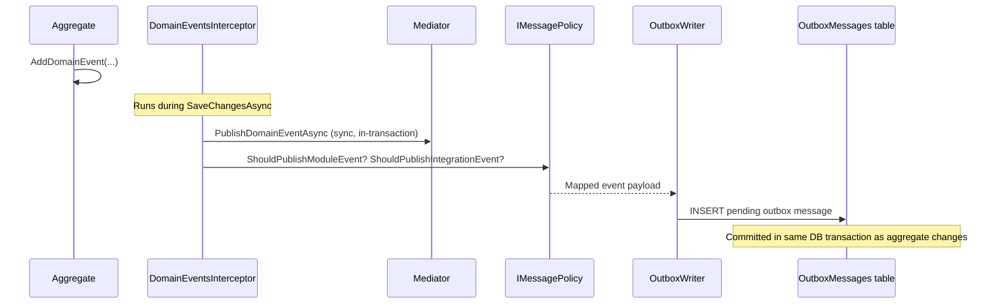
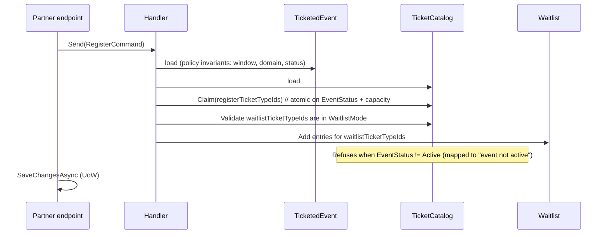
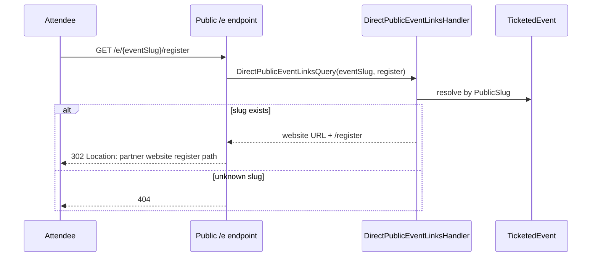
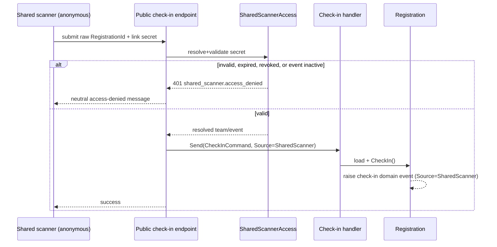
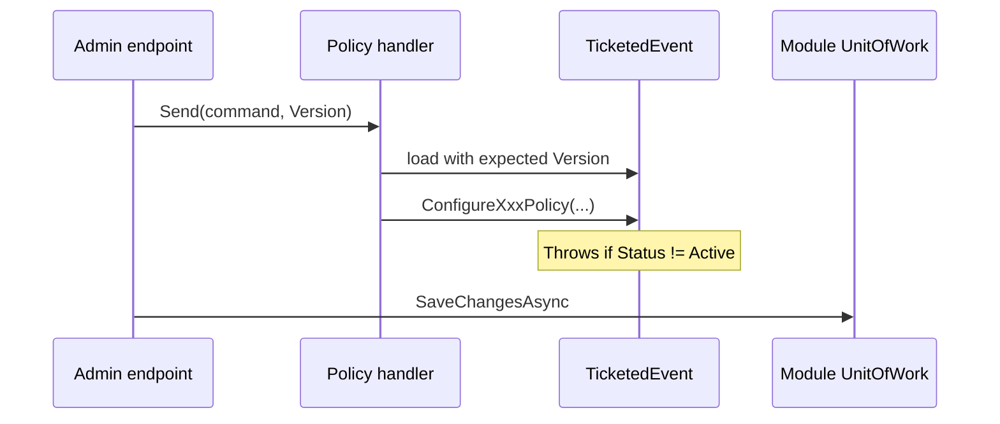
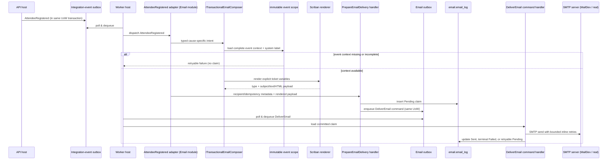
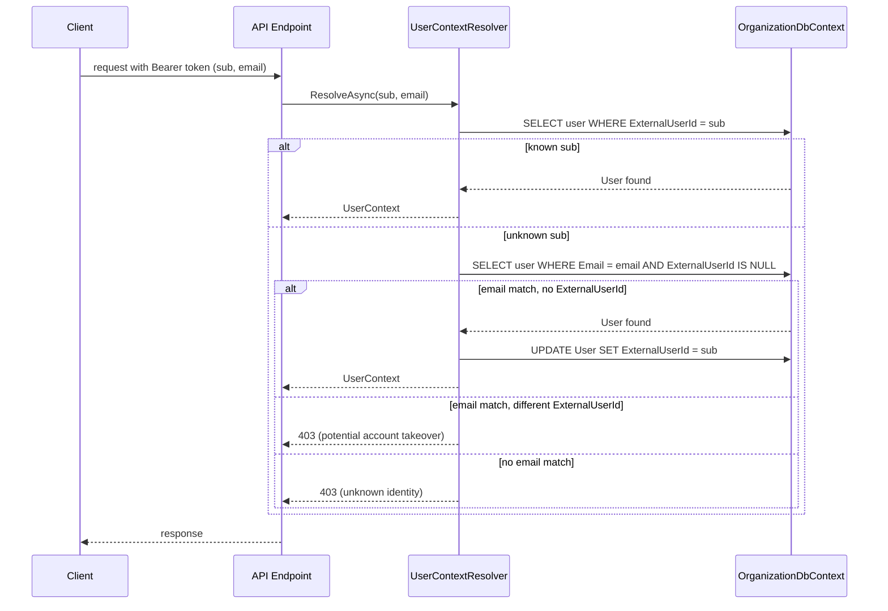
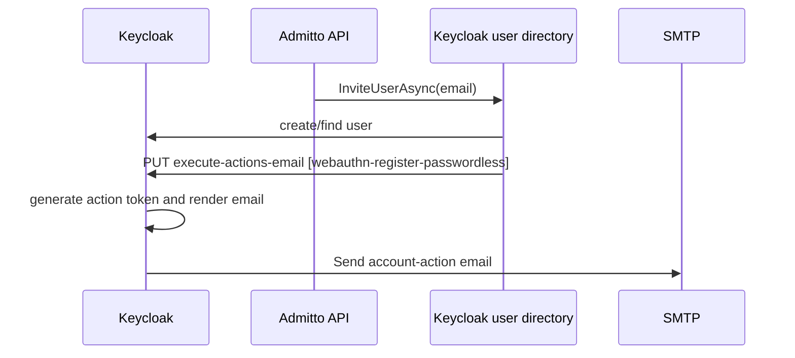

# 6. Runtime view

## 6.1 Admin command flow (write path)

This is the most important flow — it shows how a write request moves through validation, authorization, command handling, persistence, and outbox dispatch.

```mermaid
sequenceDiagram
  participant Client
  participant Context as UserContextResolutionMiddleware
  participant Endpoint as API Endpoint
  participant Filter as ValidationFilter
  participant Auth as Authorization
  participant Mediator
  participant Handler as Command Handler
  participant UoW as Module UnitOfWork
  participant DbCtx as Module DbContext
  participant Interceptor as DomainEventsInterceptor
  participant Outbox as OutboxWriter

  Client->>Endpoint: POST /admin/...
  Endpoint->>Context: Resolve JWT user context from route scope
  Context-->>Endpoint: Cached user context or 403
  Endpoint->>Filter: FluentValidation on request DTO
  Filter-->>Endpoint: Valid or 400
  Endpoint->>Auth: Policy check (admin / team role)
  Endpoint->>Mediator: Send(command)
  Mediator->>Handler: HandleAsync(command)
  Handler->>DbCtx: Mutate aggregates
  Endpoint->>UoW: SaveChangesAsync()
  UoW->>DbCtx: SaveChanges (triggers interceptor)
  Interceptor->>Mediator: PublishDomainEventAsync (within transaction)
  Interceptor->>Outbox: TryEnqueue mapped module/integration events
  DbCtx-->>UoW: Transaction committed
  UoW->>Outbox: Best-effort dispatch to queue
  Endpoint-->>Client: 200/201
```

Key invariant: the **endpoint** calls `SaveChangesAsync`, not the handler. Handlers mutate state but never commit.

## 6.2 Domain event to outbox flow

Shows how a domain event raised inside an aggregate ends up as a queued message.

```mermaid
sequenceDiagram
  participant Aggregate
  participant Interceptor as DomainEventsInterceptor
  participant Mediator
  participant Policy as IMessagePolicy
  participant Writer as OutboxWriter
  participant Table as OutboxMessages table

  Aggregate->>Aggregate: AddDomainEvent(...)
  Note over Interceptor: Runs during SaveChangesAsync
  Interceptor->>Mediator: PublishDomainEventAsync (sync, in-transaction)
  Interceptor->>Policy: ShouldPublishModuleEvent? ShouldPublishIntegrationEvent?
  Policy-->>Writer: Mapped event payload
  Writer->>Table: INSERT pending outbox message
  Note over Table: Committed in same DB transaction as aggregate changes
```

Message type naming: module events use `{module}.{event-name}` (e.g. `organization.user-created`); integration events use `integration.{module}.{event-name}`.

Pending outbox rows are not lost when the immediate post-commit dispatch fails. The Worker host runs a bounded retry scanner for every module DbContext that implements `IOutboxDbContext`: it reads `Pending` rows older than the configured retry minimum age, sends them to the queue, and marks them `Sent` after a successful queue send. The age gate avoids racing the same unit of work's immediate post-commit dispatch. Multiple Worker instances may still race and produce duplicate queue deliveries if a send succeeds but marking `Sent` fails; downstream handlers must remain idempotent.

## 6.3 Cross-module query

Modules never access each other's DbContext. Instead, the consuming module calls a facade defined in the provider's Contracts project.

Example: Registrations module needs ticket types from Organization.

1. `RegisterAttendeeHandler` calls `IOrganizationFacade.GetTicketTypesAsync(eventId)`
2. `OrganizationFacade` dispatches `GetTicketTypesQuery` via `IMediator`
3. Handler queries `OrganizationDbContext` and returns `TicketTypeDto[]`
4. Optional `CachingOrganizationFacade` decorator caches repeated lookups

The same facade is used by authorization handlers to resolve team membership roles.

For reconfirmation delivery, `RegistrationsFacade.GetReconfirmDeliveryStateAsync` delegates to the dedicated `GetReconfirmDeliveryStateHandler`. The handler reads authoritative Registrations aggregates and returns either a complete allowed state (registration timestamp, interval, and maximum) or a suppression reason; Email then applies its successful-log allowance before SMTP admission. The recurring evaluation uses its start instant for the policy window and quiet-hours gate while retaining the other authoritative delivery guards.

## 6.4 Event creation (Organization → Registrations async flow)

Event creation is a two-phase async flow. Organization validates team-level invariants and acts as the creation **gatekeeper**; Registrations materialises the authoritative `TicketedEvent` and reports back with an outcome. The Admin UI submits the request and polls a creation-status endpoint until it sees a terminal state.

```mermaid
sequenceDiagram
  participant UI as Admin UI
  participant OrgEp as Organization endpoint
  participant Team as Team aggregate
  participant OrgOutbox as Org outbox
  participant RegHandler as Registrations integration-event handler
  participant RegEvent as TicketedEvent aggregate
  participant Catalog as TicketCatalog
  participant RegOutbox as Reg outbox
  participant OrgHandler as Organization integration-event handler

  UI->>OrgEp: POST /admin/teams/{teamId}/events
  OrgEp->>Team: RequestCreation(requester)
  Team->>Team: EnsureNotArchived(); PendingEventCount++
  Team->>Team: Add TeamEventCreationRequest (Pending)
  OrgEp->>OrgOutbox: TicketedEventCreationRequested (CreationRequestId, TeamId, ...)
  OrgEp-->>UI: 202 Accepted + Location: /admin/teams/{teamId}/event-creations/{id}
  OrgOutbox->>RegHandler: deliver
  RegHandler->>RegEvent: insert TicketedEvent (TeamId, ...)
  alt success
    RegHandler->>Catalog: create Active TicketCatalog
    RegHandler->>RegOutbox: TicketedEventCreated
  else failure
    RegHandler->>RegOutbox: TicketedEventCreationRejected
  end
  RegOutbox->>OrgHandler: deliver (idempotent on CreationRequestId)
  OrgHandler->>Team: RegisterEventCreated / RegisterEventRejected
  Team->>Team: PendingEventCount--; Active/Rejected counter++
  UI->>OrgEp: GET /admin/teams/{teamId}/event-creations/{id} (poll)
  OrgEp-->>UI: { status: Created | Rejected | Pending, link }
```

Key properties:

- Organization owns `PendingEventCount` and the `TeamEventCreationRequest` state; these are mutated in the same unit of work as the outbox write.
- `CreationRequestId` is the idempotency key on every response event. Organization handlers are idempotent on redelivery and also tolerate out-of-order arrival of `TicketedEventCreated` vs the original request's own commit.
- A Quartz job (`ExpireStaleEventCreationRequestsJob`) expires `Pending` requests older than a configurable timeout and rolls back `PendingEventCount`, so team-archive is never blocked indefinitely by lost or unprocessable requests.

## 6.5 Event archive (Registrations → Organization)

`Archive` targets the authoritative `TicketedEvent` aggregate in Registrations. The lifecycle transition is projected atomically onto `TicketCatalog.EventStatus` (via an in-module domain event in the same unit of work), and propagated to Organization as an integration event so the team's counters can be updated.

```mermaid
sequenceDiagram
  participant UI as Admin UI
  participant RegEp as Registrations endpoint
  participant Event as TicketedEvent
  participant Catalog as TicketCatalog
  participant RegOutbox as Reg outbox
  participant OrgHandler as Organization integration-event handler
  participant Team

  UI->>RegEp: POST /admin/.../events/{eventSlug}/archive
  RegEp->>Event: Archive()
  Event-->>Event: raises TicketedEventStatusChanged (in-module)
  Event->>Catalog: project EventStatus (same UoW)
  RegEp->>RegOutbox: TicketedEventArchived (same UoW)
  RegOutbox->>OrgHandler: deliver (idempotent on TicketedEventId + transition)
  OrgHandler->>Team: RegisterEventArchived
  Team->>Team: ActiveEventCount-- ; ArchivedEventCount++
```

Because `TicketCatalog.EventStatus` is updated in the same transaction as `TicketedEvent.Archive`, any in-flight registration that has already loaded `TicketCatalog` at a prior version fails its claim with a `DbUpdateConcurrencyException` — no registration can slip past a lifecycle transition.

## 6.6 Partner attendee registration and waitlist submission (atomic status + capacity gate)

Partner attendee endpoints are mounted under `/api/events/{eventSlug}/...` and require `X-Api-Key`. API-key authentication resolves the owning team into a `team_id` claim, and partner endpoints derive `TeamId` from that claim rather than from the URL. Endpoint code resolves `TicketedEvent.PublicSlug` within the API-key owner's team scope before dispatching handlers. Handlers still receive both `TeamId` and `TicketedEventId`, so event/resource lookups remain scoped to the API key owner's team and a valid key for another team receives the normal not-found behavior.

The unified registration handler loads both `TicketedEvent` (for window / domain / schema policy checks) and `TicketCatalog` (for the active-status and atomic capacity claim) in the same unit of work. The unified create endpoint accepts explicit `registerTicketTypeIds`, `waitlistTicketTypeIds`, and an optional `couponCode`; coupon redemption may cover a subset of registration tickets while the remainder follows public self-service rules. Capacity is claimed only for registration tickets, while waitlist entries are created for waitlist tickets in the same transaction.

```mermaid
sequenceDiagram
  participant Endpoint as Partner endpoint
  participant Handler
  participant Event as TicketedEvent
  participant Catalog as TicketCatalog

  Endpoint->>Handler: Send(RegisterCommand)
  Handler->>Event: load (policy invariants: window, domain, status)
  Handler->>Catalog: load
  Handler->>Catalog: Claim(registerTicketTypeIds)  // atomic on EventStatus + capacity
  Handler->>Catalog: Validate waitlistTicketTypeIds are in WaitlistMode
  Handler->>Waitlist: Add entries for waitlistTicketTypeIds
  Note over Catalog: Refuses when EventStatus != Active (mapped to "event not active")
  Endpoint->>Endpoint: SaveChangesAsync (UoW)
```

Every submission produces or reuses the email's `Registration`; one with no confirmed tickets is `Waitlisted`. What a submission does to an existing registration depends on whether it is still live. A `Registered` registration, or a `Waitlisted` one with at least one active waitlist entry, is live: registering tickets for it is rejected as a duplicate, and a waitlist-only submission behaves like the equivalent update (the entries are added and `Registration.ChangeTickets` raises the ticket-changed email). A `Cancelled` registration, or a `Waitlisted` one whose entries are all gone (its offer expired, or an organiser removed the entry), is not live: `Registration.Reset` starts a new registration cycle, so the attendee can register or rejoin the waitlist and gets a fresh confirmation email (the waitlist confirmation for a waitlist-only submission). After the email-verification token is accepted and terminal event/window/domain/detail guards pass, the unified create handler classifies submitted register/waitlist ticket IDs against the current `TicketCatalog` before mutating capacity or waitlists. Recoverable ticket-selection mismatches return a 409 `registration.ticket_state_conflict` problem response with grouped submitted IDs (`registerableTicketTypeIds`, `waitlistableTicketTypeIds`, `unavailableTicketTypeIds`, `unknownTicketTypeIds`, `invalidForRequestedActionTicketTypeIds`) and persist no partial registration, waitlist entry, or capacity change. Coupon-granted tickets bypass capacity and may bypass the registration window and domain policy, but public and waitlist changes retain their normal gates; coupons do not bypass the active-status gate. "Capacity" for this self-service gate is `TicketType.PublicCapacity`, the only enforced limit; admin registrations, organiser coupons and VIP offers are admin tickets on top of it — see [§8.14](08-crosscutting-concepts.md#public-capacity-is-the-only-enforced-limit).

Joining a waitlist always happens as part of registering or updating a registration (the unified create handler and the partner update handler are the only two `Waitlist.AddEntry` callers), so every `WaitlistEntry` carries the `RegistrationId` of the registration it was created alongside, set once at construction and never resolved later. `Waitlist`'s coupon-issuing methods (`IssueNextCoupon`, `IssueCouponsToAllEntries`, `IssueCouponToEntry`, `Disable`) read it directly off the entry instead of looking it up by email, and `WaitlistCouponIssuedDomainEvent.RegistrationId` is correspondingly non-nullable end to end (domain event, integration event, and the waitlist-offer email's call-to-action link). The Admin UI's per-ticket-type waitlist page uses the same `RegistrationId` to join each active entry to its `Registration` for the attendee's full email and name (no masking, same trust level as the registrations table) and to link the row to that attendee's details page.

Existing attendee registrations are updated through `PUT /api/events/{eventSlug}/registrations/{registrationId}`. This Partner API call derives team scope from `X-Api-Key`, resolves the event slug within that team, and treats `registrationId` as the registration bearer credential. Partner sites that only have the attendee's verified email can first call `GET /api/events/{eventSlug}/registrations/resolve?email=...`; this requires the same `X-Api-Key` plus an email-verification bearer token whose embedded email matches the query email, and returns only the matching `registrationId`. The update request replaces the attendee-editable registration state: first name, last name, additional details, and — like the unified create endpoint — two separate final-state ticket-type-id lists, `registerTicketTypeIds` and `waitlistTicketTypeIds`, so a single request can move a ticket type selection between confirmed and waitlisted in either direction. The handler diffs each submitted list against the registration's current confirmed tickets and current waitlist selections — both an active queue entry and an outstanding, unredeemed offer (`Offered`) count as a current selection (loaded across all of the event's `Waitlist` aggregates); only the newly-added deltas are re-classified with the same registerable/waitlistable/unavailable/unknown logic used by create, so a request whose classification no longer matches reality at submission time is rejected with the same 409 `registration.ticket_state_conflict` shape, and unchanged (kept) selections are never re-validated against current capacity. Moving a ticket type from confirmed into the waitlist list releases its catalog claim and adds an active waitlist entry; moving one from waitlisted into confirmed claims catalog capacity and removes the waitlist entry — both in the same Registrations unit of work as the attendee-detail changes, with `Registration.Status` recomputed from the resulting confirmed-ticket count. The registration window is enforced unless the request carries a coupon that bypasses it (`Coupon.BypassRegistrationWindow`, set on every waitlist offer), and then only for what that coupon grants: after close, an attendee can still claim an offer issued before close until it expires, but any other ticket or waitlist change in the same request is rejected with `registration.closed`. The request's optional `couponCode` field (renamed from `waitlistCouponCode`, a breaking change with no transition period, shipped together with the dependent partner event-site update) accepts a coupon of either source (see coupon redemption below); the ticket types it grants skip the self-service classification and are claimed under the coupon's capacity pool, while the final confirmed ticket set is still validated for duplicates, unknown ticket types, and overlapping time slots. Ticket-change side effects are emitted when either the final confirmed ticket selection or the final waitlisted ticket selection differs from the current one — so a pure waitlist-to-waitlist switch sends a ticket-change email, while details-only edits do not. The registration activity log still records only confirmed-ticket changes. A ticket type dropped from the submitted waitlist list is removed from whichever selection it was: leaving the active queue, or — for an `Offered` entry — declining the offer (`Waitlist.RemoveEntry` expires the backing `Coupon`, releasing an automatic offer's hold, with no "offer expired" email since the attendee is already getting the update's own response). An `Offered` ticket type claimed in the same request via `couponCode` is excluded from that removal so its redemption isn't undone by the leave step running first. If, after all of the request's changes, the registration is still `Waitlisted` (no confirmed tickets) and holds no selection on any of the event's waitlists — no active entry, no outstanding offer — it is auto-cancelled with `CancellationReason.LeftWaitlist`, a silent reason (no cancellation email) distinct from the organizer-driven `TicketTypesRemoved`.

Joining or leaving a waitlist happens only through the ticket-type selection on create and update. The previous standalone Partner API routes `POST /api/events/{eventSlug}/waitlist/{ticketTypeId}` and `DELETE /api/events/{eventSlug}/waitlist/{ticketTypeId}` are no longer exposed.

Coupon redemption follows one rule whatever the coupon's `Source`; `Source` only selects which email fires when the coupon is created (coupon invitation for `Organiser`, waitlist offer for `Waitlist`) and which capacity pool a redemption draws from (`Coupon.RedemptionClaimMode`, see [§8.14](08-crosscutting-concepts.md#814-in-aggregate-lifecycle-invariants)). `Coupon.Redeem` checks status and email, then succeeds as long as the ticket types being claimed overlap the coupon's allowed ticket types by at least one (on the update paths only newly added confirmed tickets count, since tickets the registration already holds are not granted by the coupon); it returns that overlap as the granted ticket types, forfeits the rest, and marks the coupon fully redeemed (single-use). The unified create handler and partner update handler redeem a coupon only for newly selected, allow-listed ticket types; other selected registration types are classified through the public path, so the former coupon-only `Coupon.EnsureAllowsAll` rule no longer applies. On every redemption path (create-with-coupon, partner update, admin ticket change), `Waitlist.ApplyCouponRedemption` then runs on the waitlist of each granted ticket type: it removes the redeeming email's active entry, and marks the coupon redeemed on the waitlist that issued it, if any.

A waitlisted attendee claims an offer from their existing `Waitlisted` registration: registering with the coupon resets that registration (`Registration.Reset` accepts a `Cancelled` or `Waitlisted` one) with the coupon's tickets, so it becomes `Registered`, and the attendee's other waitlist entries stay intact. Admin registration (`AdminRegisterAttendeeHandler`) also accepts a `Waitlisted` registration. Its tickets are admin tickets, and for each registered ticket type it removes the attendee's waitlist entry and withdraws any offer they hold for it (`Waitlist.WithdrawCoupon` plus `Coupon.Expire`): the admin ticket doesn't redeem the offer, no expired-offer email is sent, and an automatic offer's released hold goes to the next person in the queue.

Waitlist-related attendee emails are driven by Registrations domain events relayed through `RegistrationsIntegrationEventPublisher`. Issuing a waitlist coupon (`Waitlist.IssueNextCoupon` for automatic front-of-queue promotion, or `Waitlist.IssueCouponToEntry` for manual VIP promotion, below) raises `WaitlistCouponIssuedDomainEvent`, which sends the waitlist-offer email. An automatic offer also holds a public seat on the ticket type (`TicketCatalog.HoldForWaitlistOffer`, see [§8.14](08-crosscutting-concepts.md#waitlist-held-capacity)); a VIP offer takes no hold. Coupons are never revoked: a coupon ends by being redeemed or by expiring (`CouponStatus` is `Active`/`Redeemed`/`Expired`, derived from `RedeemedAt` and `ExpiresAt`). Each tracked `WaitlistCoupon` copies the coupon's `ExpiresAt` at issuance, and `ProcessExpiredWaitlistCouponsJob` finds its work through the `Waitlist` aggregates themselves — waitlists holding `Issued` coupons whose `ExpiresAt` is past the cutoff (now minus the grace period) — loading the matching `Coupon` rows only for the recipient and code the email needs. For each lapsed coupon it calls `Waitlist.ExpireCoupon`, which marks the `WaitlistCoupon` `Expired`, releases an automatic offer's hold on the `TicketCatalog`, and raises `WaitlistCouponExpiredDomainEvent` — one per lapsed coupon, whether or not anyone is still queued — so its recipient receives a distinct "waitlist offer expired" email. If the coupon row or the ticket type no longer exists there is nothing to put in that email, so the coupon is expired without raising the event (an automatic offer's hold is still released). The job counts no freed slots: releasing a hold raises `WaitlistCapacityAvailableDomainEvent` only when that leaves a seat available, and its handler offers that seat to the front of the queue in the same save. A lapsed VIP offer held no public seat, so it frees nothing and offers nobody a seat. Once nobody is queued and no coupons are outstanding, the `Waitlist` raises `WaitlistExhaustedDomainEvent`, which lifts WaitlistMode once the catalog also counts nobody queued and no offers outstanding (see [§8.14](08-crosscutting-concepts.md#waitlist-held-capacity)). The job writes both the `Waitlist` and the `TicketCatalog`, so a registration, redemption or cancellation committing on the same catalog first makes the job's save fail with a concurrency conflict, and the next run retries. Cancelling a registration releases its tickets in the same save (`ReleaseTicketsHandler`, on `RegistrationCancelledDomainEvent`), and `TicketCatalog.Release` credits each ticket to the pool it came from. Releasing public tickets raises `WaitlistCapacityAvailableDomainEvent` for each ticket type in WaitlistMode left with a seat available; if `PublicCapacity` was lowered below what's committed, the first cancellations only make up that shortfall. Cancelling an admin registration, or a redeemed VIP offer, frees no public seat and offers nobody a seat. **The waitlist stops at registration close.** `ProcessWaitlistNotificationsHandler`, the path every automatic offer goes through (`WaitlistCapacityAvailableDomainEvent` after a cancellation, an expired offer's released hold or a capacity raise), issues nothing at or after `RegistrationPolicy.ClosesAt` (`TicketedEvent.HasRegistrationClosed`). The other offer paths follow the same rule: an explicit waitlist disable offers no freed slots after close, and removing the capacity limit after close offers nobody (`PromoteEntireWaitlistHandler`), leaving everyone queued. The queue is left as it is: entries stay active, registrations stay `Waitlisted`, and nobody is emailed. Offers issued before close stay valid until they expire (waitlist coupons bypass the registration window); one that lapses after close releases its hold without offering it on, and its expired-offer email (`RegistrationClosed` on `WaitlistCouponExpiredDomainEvent`) says registration has closed instead of inviting the attendee to register again. VIP promotion still works after close, since it is an admin action on top of public capacity. Moving `ClosesAt` later, or clearing the window, raises `TicketedEventRegistrationWindowExtendedDomainEvent`; its handler re-runs the waitlist check for every ticket type in WaitlistMode, so seats freed while registration was closed go to the queue straight away, and offers everyone still waiting on a ticket type whose capacity limit was removed while closed. An event without a registration window never closes the waitlist. The offer decision reads `ClosesAt` from `TicketedEvent` but writes the `TicketCatalog`, so a window reopened at the same moment as a cancellation can leave one seat unoffered until the next trigger (see [§11.2](11-risks-and-technical-debt.md#112-technical-debt)).

Cancelling a registration also records on `RegistrationCancelledDomainEvent`/`RegistrationCancelledIntegrationEvent` whether it was `Waitlisted` (held no confirmed tickets) at the moment of cancellation; an attendee-requested cancellation of such a registration uses the waitlist-cancellation template, which describes removal from the waitlist, while cancelling a `Registered` one (with or without extra waitlist entries) keeps the existing cancellation wording.

An organizer can promote one specific active waitlist entry out of queue order (a VIP override) from the Admin UI's per-ticket-type waitlist page ("Promote to VIP" on an active entry row) through `POST /admin/teams/{teamId}/events/{eventId}/ticket-types/{ticketTypeId}/waitlist/{entryId}/promote` (Organizer role). `PromoteWaitlistEntryHandler` loads the `TicketedEvent`, `TicketCatalog` (event must be active), and the ticket type's `Waitlist`, then calls `Waitlist.IssueCouponToEntry`. It shares issuance with automatic promotion: the entry is removed from the active queue immediately (at issuance, not at redemption) and the remaining positions are renumbered, the `Waitlist`-sourced coupon's expiry uses the same `WaitlistClaimWindowCalculator` claim-window/quiet-hours calculation, the coupon is tracked on the waitlist, and the same `WaitlistCouponIssuedDomainEvent` sends the same waitlist-offer email. The endpoint returns 201 with the new coupon id. Targeting an entry that is no longer active, or never existed, fails with 409 `waitlist.entry_not_active`. The resulting coupon is redeemed like any other (see coupon redemption above). A VIP offer takes no public hold and never affects the offers made to the rest of the queue; redeemed, it is an admin ticket on top of public capacity (see [§8.14](08-crosscutting-concepts.md#public-capacity-is-the-only-enforced-limit)).

Changing a waitlisted ticket type through `PUT /admin/teams/{teamId}/events/{eventId}/ticket-types/{ticketTypeId}` (`TicketCatalog.UpdateTicketType`) affects the people waiting in one of three ways, each handled in the same unit of work as the update:

- **Raising capacity.** Raising `PublicCapacity` while in WaitlistMode raises `WaitlistCapacityAvailableDomainEvent` when seats are available after the change. `WaitlistCapacityAvailableDomainEventHandler` dispatches `ProcessWaitlistNotificationsCommand`, which issues coupons (and waitlist-offer emails) to the front of the queue while the catalog has seats available, capped at the number of active entries. Outstanding VIP offers take no public seat, so they don't reduce the offers sent. A shortfall left by an earlier lowering of `PublicCapacity` is made up first.
- **Lowering capacity.** Lowering `PublicCapacity` below what's committed is allowed: public sales are sold out and the next cancellations make up the shortfall before anyone in the queue gets an offer. Lowering it by N and then N + 1 cancellations sends exactly one offer.
- **Removing the capacity limit** (`PublicCapacity` → null). A waitlist needs bounded capacity, so the aggregate switches `WaitlistEnabled` and WaitlistMode off and raises `WaitlistCapacityLimitRemovedDomainEvent`. Its handler dispatches `PromoteEntireWaitlistCommand`, whose handler calls `Waitlist.IssueCouponsToAllEntries`: every active entry gets a coupon and the waitlist-offer email. After registration has closed it offers nobody and leaves everyone queued until the registration window is reopened (see the waitlist-close rule above). It does not go through `ProcessWaitlistNotificationsHandler`, whose `WaitlistEnabled && WaitlistMode` guard no longer holds at that point. Nobody is removed without an offer. This path takes precedence when an update removes the limit and switches the waitlist off together (which is what the Admin UI sends).
- **Explicitly disabling the waitlist** (`WaitlistEnabled` → false, capacity still bounded). The aggregate raises `WaitlistDisabledDomainEvent`, carrying the seats available after the same update if it was in WaitlistMode. `DisableWaitlistHandler` calls `Waitlist.Disable`, which first offers those seats to the front of the queue, then removes every remaining active entry (outstanding offers — `Offered` entries with unredeemed coupons — are left alone and stay valid, keeping their hold, until redeemed or expired). Removed attendees get no email, because the organizer informs them. For each removed entry, the handler then checks whether the owning registration is `Waitlisted` with no confirmed tickets and no selection left anywhere (`RegistrationCouponHelpers.CancelIfExhausted` across all of the event's waitlists); if so it is auto-cancelled with `CancellationReason.TicketTypesRemoved` (no email — same silent reason as explicit single-entry removal, `RemoveWaitlistEntryHandler`). A registration that still holds another active entry or offer elsewhere is left `Waitlisted`. Either way, the registration read model and later confirmation / ticket-changed emails no longer list the disabled ticket type, because both are derived from active waitlist entries. When an outstanding coupon later lapses, `ProcessExpiredWaitlistCouponsJob` still sends the expired-offer email and releases the hold, and no offer follows because the ticket type is no longer in WaitlistMode.

The Admin UI's edit form asks for confirmation only for an explicit disable of a waitlist with people waiting. Removing the capacity limit shows an informational note that everyone waiting will receive an offer.

## 6.6.1 Anonymous public event links

Anonymous Public API routes are mounted under `/e/{eventSlug}`. They resolve `TicketedEvent.PublicSlug` and never accept request-controlled redirect targets. The canonical event route redirects to the stored event website URL; action routes append website-relative paths while preserving any existing path prefix on the stored website URL.

```mermaid
sequenceDiagram
  participant Attendee
  participant Endpoint as Public /e endpoint
  participant Handler as DirectPublicEventLinksHandler
  participant Event as TicketedEvent

  Attendee->>Endpoint: GET /e/{eventSlug}/register
  Endpoint->>Handler: DirectPublicEventLinksQuery(eventSlug, register)
  Handler->>Event: resolve by PublicSlug
  alt slug exists
    Handler-->>Endpoint: website URL + /register
    Endpoint-->>Attendee: 302 Location: partner website register path
  else unknown slug
    Endpoint-->>Attendee: 404
  end
```

`/e/{eventSlug}/cancel/{registrationId}` and `/e/{eventSlug}/edit/{registrationId}` follow the same lookup path and append `cancel/{registrationId}` or `edit/{registrationId}`. Query-string values such as `redirect=` are ignored.

## 6.6.2 Anonymous public QR-code retrieval

QR-code retrieval is exposed only as `GET /e/{eventSlug}/qr-code/{registrationId}`. The handler resolves the event by public slug, then loads the registration by `(eventId, registrationId)`, and returns a PNG whose payload is the literal registration ID. Cancelled registrations still resolve; QR-code revocation is not part of this flow.

The previous Partner API route `GET /api/events/{eventId}/registrations/{registrationId}/qr-code` is no longer exposed.

## 6.6.3 Admin QR check-in

The admin scanner is online-only. It reads the literal `RegistrationId` from the QR code and sends that raw value together with the selected team and event to the Admin API; the server performs all scope and registration validation. Crew can list registrations, open attendee detail, create registrations, and check attendees in; cancellation, ticket changes, email resend, and reconfirmation remain Organizer/Owner operations. Check-in requires the selected event to be `Active`, but does not require the current time to be within the event's start/end dates.

The scanner client defaults to the rear camera and allows a camera switch; a keyboard-wedge scanner feeds the raw `RegistrationId` into the same authoritative check-in API path. On success it shows the attendee and ticket selections until the operator dismisses the result or scans a different credential; it continues scanning while suppressing duplicate reads of the currently displayed QR code, increments the visible checked-in count locally, and invalidates/refetches the attendance summary. `AlreadyCheckedIn`, `Cancelled`, `Waitlisted`, `InvalidForEvent`, and `EventNotActive` are terminal outcomes shown until dismissal; only a network failure retains the credential for an explicit retry. An early-arrival warning appears from 30 minutes before the event start until start time and can be acknowledged without blocking scanning.

```mermaid
sequenceDiagram
  participant Scanner as Admin scanner
  participant Endpoint as Admin check-in endpoint
  participant Auth as Team/event authorization
  participant Handler as Check-in handler
  participant Event as TicketedEvent
  participant Registration
  participant Interceptor as DomainEventsInterceptor
  participant Activity as ActivityLogProjector

  Scanner->>Endpoint: submit raw RegistrationId + selected team/event
  Endpoint->>Auth: authorize selected team/event
  Endpoint->>Handler: Send(CheckInCommand)
  Handler->>Event: load selected event
  Handler->>Registration: load by (eventId, RegistrationId)
  Handler->>Registration: CheckIn()
  Registration-->>Registration: raise check-in domain event
  Endpoint->>Interceptor: SaveChangesAsync (module UoW)
  Interceptor->>Activity: dispatch domain event; project timestamp-only activity row
  Interceptor-->>Endpoint: transaction committed
  Endpoint-->>Scanner: success
```

The handler rejects a missing, wrong-event, cancelled or waitlisted registration and refuses an inactive event. A `Waitlisted` registration holds no ticket, so it returns the dedicated `Waitlisted` outcome (the scanner says the attendee has no ticket to check in) and manual lookup lists it as `Waitlisted`, not `Eligible`. It does not perform start/end gating. Check-in is one-way: `CheckedInAt` is set once, and the reciprocal invariant prevents a checked-in registration from being cancelled and a cancelled registration from being checked in. The domain event only updates the activity timeline; it does not enqueue a notification or create an audit record. Simultaneous attempts for the same registration are reconciled to one `Success`; every competing request returns `AlreadyCheckedIn` with the persisted `CheckedInAt` timestamp, rather than exposing a public concurrency conflict or creating a second check-in.

## 6.6.4 Shared scanner check-in

A door assistant opens the event's shared scanner URL (`/scan/{secret}`) with no Admitto sign-in. The Admin UI's anonymous page calls public BFF routes, which call the Admin API's public `GET /scan/{secret}`, `POST /scan/{secret}/check-in`, and `GET /scan/{secret}/lookup` endpoints — outside the `/admin` route group, so no JWT/API-key authentication applies. Every request instead resolves and validates the secret itself, in-handler, via `SharedScannerAccess.ResolveActiveEventAsync`: it loads the `TicketedEvent` whose owned `ScannerLink.Secret` matches, and rejects a malformed secret, no match, an inactive event, or a `ScannerLink` status other than `Active` (expired, revoked, or superseded by regeneration) — all with the same `shared_scanner.access_denied` (401) error, so the caller never learns which failure occurred. This check runs on every request, so an already-open scanner session loses access on its next operation after revocation, regeneration, or the event's lifecycle/end-time change.

Once resolved, check-in reuses the same `CheckInCommand`/`CheckInHandler` as the signed-in scanner (§6.6.3) with the resolved team/event ids, so registration-level validation, one-way attendance, and concurrent-scan reconciliation are identical. The only difference is `CheckInCommand.Source = CheckInSource.SharedScanner`, which `RegistrationCheckedInDomainEvent` carries through to the activity projector: a shared-scanner check-in's activity-log row carries `{"source":"SharedScanner"}` metadata, while the default (signed-in) source remains metadata-free. No individual door-assistant identity is captured anywhere.

Manual name/email lookup (for an attendee with no readable QR code) reuses the same seam: `SharedScannerLookupHttpEndpoint` resolves the event via `SharedScannerAccess.ResolveActiveEventAsync` and then dispatches the identical `LookupCheckInCandidatesQuery`/`LookupCheckInCandidatesHandler` used by the signed-in scanner (§6.6.3), scoped to the resolved team/event ids. Lookup results and eligibility states (eligible, cancelled, already checked in) are therefore identical between the signed-in and shared scanners; only eligible candidates can be selected, and confirming one calls the same `POST /scan/{secret}/check-in` path (with the selected `RegistrationId` as the credential), so a lookup-based confirmation is indistinguishable from a QR scan for validation and check-in-source attribution.

Because the route is anonymous, the request carries no authenticated `HttpContext.User`. `HttpContextUserContextAccessor` attributes the write to `StaticUserContextAccessor.SystemUser` for any unauthenticated request (not just background jobs), so `AuditInterceptor` still has a `CreatedBy`/`LastChangedBy` identity to stamp without inferring who was actually scanning.

```mermaid
sequenceDiagram
  participant Scanner as Shared scanner (anonymous)
  participant Endpoint as Public check-in endpoint
  participant Access as SharedScannerAccess
  participant Handler as Check-in handler
  participant Registration

  Scanner->>Endpoint: submit raw RegistrationId + link secret
  Endpoint->>Access: resolve+validate secret
  alt invalid, expired, revoked, or event inactive
    Access-->>Endpoint: 401 shared_scanner.access_denied
    Endpoint-->>Scanner: neutral access-denied message
  else valid
    Access-->>Endpoint: resolved team/event
    Endpoint->>Handler: Send(CheckInCommand, Source=SharedScanner)
    Handler->>Registration: load + CheckIn()
    Registration-->>Registration: raise check-in domain event (Source=SharedScanner)
    Endpoint-->>Scanner: success
  end
```

The shared scanner UI reuses the signed-in scanner component (`CheckInScanner`, §6.6.3) with a shared-scanner-specific `CheckInOperations` implementation that omits dashboard navigation and attendance-summary refresh — it has camera scanning, keyboard-wedge input, manual name/email lookup and confirmation, scan feedback, retry, and the early-arrival warning.

## 6.7 Policy mutation flow

Policy commands (`ConfigureRegistrationPolicyCommand`, `ConfigureReconfirmPolicyCommand`, `ConfigureWaitlistPolicyCommand`) load the `TicketedEvent` aggregate and call the matching policy mutator directly. Each mutator refuses when the event's status is not Active, so there is no separate lifecycle guard. Optimistic concurrency is supplied by `TicketedEvent.Version`. Moving the registration window's `ClosesAt` later re-runs the waitlist check (see [§6.6](#66-partner-attendee-registration-and-waitlist-submission-atomic-status--capacity-gate)).

```mermaid
sequenceDiagram
  participant Endpoint as Admin endpoint
  participant Handler as Policy handler
  participant Event as TicketedEvent
  participant UoW as Module UnitOfWork

  Endpoint->>Handler: Send(command, Version)
  Handler->>Event: load with expected Version
  Handler->>Event: ConfigureXxxPolicy(...)
  Note over Event: Throws if Status != Active
  Endpoint->>UoW: SaveChangesAsync
```

## 6.8 Registration-confirmation email flow

When an attendee registers successfully, the API handler emits an `AttendeeRegistered` integration event via the outbox. The Worker picks it up and translates it to a cause-specific typed intent. The single transactional composer loads one immutable event scope and returns the rendered type and content; it does not select recipients, inspect `EmailLog`, or prepare delivery. The thin integration-event handler adds recipient/idempotency metadata and invokes `PrepareEmailDelivery`. SMTP is attempted only after the Email module has committed an `EmailLog` claim and an internal delivery command.

```mermaid
sequenceDiagram
    participant Api as API host
    participant Outbox as Integration-event outbox
    participant Worker as Worker host
    participant Adapter as AttendeeRegistered adapter (Email module)
    participant Composer as ITransactionalEmailComposer
    participant Scope as immutable event scope
    participant Renderer as Scriban renderer
    participant Prepare as PrepareEmailDelivery handler
    participant EmailOutbox as Email outbox
    participant EmailLog as email.email_log
    participant Delivery as DeliverEmail command handler
    participant SMTP as SMTP server (MailDev / real)

    Api->>Outbox: AttendeeRegistered (in same UoW transaction)
    Worker->>Outbox: poll & dequeue
    Worker->>Adapter: dispatch AttendeeRegistered
    Adapter->>Composer: typed cause-specific intent
    Composer->>Scope: load complete event context + system label
    alt event context missing or incomplete
        Scope-->>Worker: retryable failure (no claim)
    else context available
        Composer->>Renderer: render explicit ticket variables
        Renderer-->>Composer: type + subject/text/HTML payload
        Adapter->>Prepare: recipient/idempotency metadata + rendered payload
        Prepare->>EmailLog: insert Pending claim
        Prepare->>EmailOutbox: enqueue DeliverEmail command (same UoW)
        Worker->>EmailOutbox: poll & dequeue DeliverEmail
        Worker->>Delivery: load committed claim
        Delivery->>SMTP: SMTP send with bounded inline retries
        Delivery->>EmailLog: update Sent, terminal Failed, or retryable Pending
    end
```

**Status-aware content**: `AttendeeRegistered` and `AttendeeTicketsChanged` carry the registration's confirmed ticket types and, separately, the ticket types the attendee is waitlisted for (waitlist entries live in the `Waitlist` aggregates, so the handler that changes them supplies both sets to the `Registration`). The typed `TicketConfirmationIntent` keeps the two lists apart: with at least one confirmed ticket type the ticket template renders the QR code and confirmed list plus a separate "on the waitlist for" section; with zero confirmed ticket types the composer selects the waitlist-confirmation template instead, which has no confirmed-ticket language or QR code. Resends describe confirmed tickets only, since only `Registered` registrations can request one.

**Idempotency**: the `EmailLog` row with key `attendee-registered:<registrationId>:<registeredAt>` is the send claim. A re-delivered integration event that observes a terminal claim is acked without another SMTP attempt; a pending claim can enqueue delivery again for recovery. SMTP itself is not transactional, so rare duplicate delivery races or a crash after SMTP success but before updating the log can still produce a later duplicate during recovery.

Admin and Partner ticket-confirmation resends are requested through Registrations-owned endpoints. The API validates the scoped registration, writes a Registrations outbox message carrying the resend snapshot, and returns `202 Accepted`. Partner requests derive the team scope from the API-key principal and resolve the event slug within that team before dispatching the shared resend command. The Worker delivers `TicketConfirmationResendRequestedIntegrationEvent` to the Email module, whose thin adapter creates the typed intent, invokes the composer, and passes the returned content plus resend identity to `PrepareEmailDelivery`. The durable delivery boundary owns terminal-claim idempotency with key `ticket-confirmation-resend:<registrationId>:<resendRequestId>`. Missing or incomplete event context fails before claim preparation so queue redelivery remains retryable. SMTP delivery remains Worker-only through `DeliverEmailCommand`; the API host neither creates EmailLog claims nor opens SMTP connections.

**Configuration failure**: if deployment system SMTP settings are missing or invalid, registration itself is unaffected. The email work records the failure through the normal `EmailLog`/delivery-error path and operator telemetry; this is an operability issue, not team-owned event state. Transient SMTP failures remain retryable until the configured delivery attempt limit is reached.

### OTP verification-code email

An `OtpCodeRequested` integration event is translated by the Email module's thin adapter into a typed verification-code intent for the single `ITransactionalEmailComposer`. The composer receives only typed cause facts (`TeamId`, `TicketedEventId`, and the plain code); it does not receive recipient or idempotency metadata. The composer loads one complete Email-owned event scope, applies the absent-team defaults (`Admitto` and `#2563eb`), and returns rendered `VerificationCode` content from the closed mapping `plain_code`, `event_name`, and `team_name`. The adapter then supplies the recipient and `otp-requested:{OtpCodeId}` idempotency key to `PrepareEmailDelivery`, which owns the claim and delivery outbox. Missing or incomplete event context fails before the `EmailLog` claim and Email outbox enqueue, allowing queue redelivery after projection catch-up.

## 6.9 Reconfirm scheduling and cycle limits (configurable recurring active-event evaluation; hourly default)

The reconfirmation policy is owned by `TicketedEvent` in Registrations. Email projects the schedule-affecting event data needed for evaluation: policy presence and window, minimum email interval, optional event-local quiet hours, event time zone, and lifecycle state. A recurring Quartz job in the Worker evaluates enabled Active events on the restart-required `Email:Reconfirmation:Interval` setting, which defaults to one hour and must be at least one minute. The Worker fails startup when the setting is missing, malformed, or below the minimum. The setting is captured when the Worker starts; it is not dynamically reloaded. Ticket types may add an optional maximum reconfirmation-email count, with the strictest configured value governing each registration's current cycle.

```mermaid
sequenceDiagram
    participant RegOutbox as Reg outbox
    participant Projection as Email event context projection
    participant Quartz as Clustered Quartz scheduler
    participant Eval as SendReconfirmationEmailsJob
    participant Facade as IRegistrationsFacade
    participant SMTP as SMTP server
    participant EmailLog as email.email_log
    participant Outbox as Email outbox

    RegOutbox->>Projection: project event details, policy, time zone, and lifecycle
    Quartz->>Eval: recurring evaluation at configured interval
    Eval->>Projection: read enabled Active event specifications
    loop each enabled Active event
      alt now < closesAt
        Eval->>Eval: require evaluation start ∈ [opensAt, closesAt) and outside quiet hours
        Eval->>Facade: QueryRegistrationsAsync(Status=Registered, HasReconfirmed=false)
        Facade-->>Eval: candidate projection
        Eval->>Eval: apply configured minimum interval
        alt eligible candidates present
          Eval->>Eval: create one immutable event composition scope and built-in template
          loop live candidates
            Eval->>Facade: authoritative delivery check
            Eval->>Eval: compose typed attendee intent with registration-specific facts
            Eval->>EmailLog: insert Pending claim matched to registration and cycle
            Eval->>SMTP: send through shared run session
            Eval->>EmailLog: update claim to Sent or Failed
          end
        else no eligible candidates
          Eval-->>Quartz: continue (no-op for event)
        end
      else now >= closesAt
        Eval->>Eval: claim durable policy-close evaluation
        Eval->>Facade: QueryRegistrationsAsync(Status=Registered, HasReconfirmed=false)
        Facade-->>Eval: candidate projection
        Eval->>Eval: ignore quiet hours and minimum interval; count successful logs
        Eval->>Eval: select only attendees at effective maximum
        Eval->>Outbox: ReconfirmAutoExpiredIntegrationEvent (selected attendees only)
        Note over Eval: no batch is created; repeated interval ticks are no-ops
      end
    end
```

**Eligibility**: routine evaluation requires an enabled policy, an Active event, and the evaluation start instant in the half-open window `[opensAt, closesAt)`. Optional event-local quiet hours gate starting routine reconfirmation delivery. For each registered attendee with `HasReconfirmed=false`, the configured minimum whole-hour interval since registration or the last reconfirmation email must also have elapsed. The same check is applied again by the authoritative pre-SMTP delivery gate. Only successfully delivered reconfirmation emails matched to the registration's current cycle count toward that cycle's strictest ticket-type maximum. During routine evaluation, an otherwise-due attendee already at that maximum is auto-cancelled through the normal flow instead of receiving another reminder. At the first scheduler tick where `now >= closesAt`, the job makes one durable terminal evaluation, creates no routine delivery work, ignores quiet hours and the minimum interval, and auto-cancels only registered, unreconfirmed attendees already at the effective maximum. Below-max attendees remain registered and can still reconfirm. The cancellation event follows the normal cancellation flow, whose Email handler dispatches the reconfirm-cancelled notification without quiet-hours gating. There is no policy-close trigger or dynamic reconfirmation fan-out trigger.

**Attendee reconfirm action**: the reconfirm email CTA points at the Admitto public `reconfirm_link` (`/e/{publicSlug}/reconfirm/{registrationId}`), which redirects to the event website. The event website then POSTs back to the API-key-authenticated partner endpoint `POST /api/events/{eventSlug}/registrations/{registrationId}/reconfirm`, invoking `Registration.Reconfirm()` (idempotent; rejected for a cancelled or waitlisted registration). This sets `HasReconfirmed=true`, so the attendee drops out of the next evaluation's candidate set. As with other partner endpoints, the write is audited against the API key's team identity. A new registration or a reset/reregistration after cancellation starts a fresh reconfirmation cycle.

**Lifecycle cleanup**: clearing the reconfirm policy or archiving the event updates the Email projection so the event is no longer enabled and Active. Future evaluations therefore skip it and create no routine reconfirmation work.

**Projection consistency**: Email rendering and scheduling use the latest `email.event_email_context_view` row available when the worker handles a message. Recent Organization/Registrations edits may lag by queue delivery time; this staleness is accepted for email rendering and does not affect registration correctness.

For reconfirmation delivery, projection lag cannot authorize a stale reminder: each candidate is checked against the authoritative live Registrations state immediately before submission. The evaluation start instant is used for the policy window and quiet-hours gate; current authoritative lifecycle, registration status, cycle, and ticket selection still suppress a candidate that changed after evaluation began. Rendering may use the eventually consistent Email projection. The evaluation has no durable batch, recipient snapshot, or resumable progress: if interrupted, the next scheduled evaluation queries fresh candidates. One SMTP session is opened lazily and shared by the run. Pending `EmailLog` claims and terminal delivery audit rows preserve idempotency; failed attempts do not count toward the successful-email allowance. An evaluation already started is allowed to finish when quiet hours begin or the requested deadline passes.

**Run logging**: each run writes structured, PII-free start and completion logs. The completion record includes duration and counts for policies found, events evaluated, emails sent, candidates deferred before claiming, deliveries skipped after admission suppression, orphaned claims failed during recovery, registrations auto-expired at policy limits, and failures. Actionable candidate warnings/errors include only the registration identifier and safe suppression reason; no recipient PII is logged. No metrics, alerts, health checks, or durable run record are created.

**Clustering**: Quartz uses the PostgreSQL-backed persistent store in `quartz-db` with clustering enabled. The evaluator is marked `[DisallowConcurrentExecution]`; together, the job constraint and clustered store prevent overlapping executions across Worker instances. During rolling deployments or temporary Worker scale-out, Quartz acquires the recurring evaluation on only one live scheduler instance, so no durable `ReconfirmationBatch` lifecycle is needed for coordination.

## 6.10 User sign-in and ExternalUserId binding

In production, Admin UI users authenticate through Keycloak's hosted passkey-only browser flow. The production browser flow starts directly at WebAuthn passwordless authentication, so users are prompted by the browser/passkey provider rather than entering an email address first. Keycloak performs the WebAuthn assertion ceremony and returns OIDC tokens to the Admin UI; Admitto never handles passkey material or WebAuthn challenge/response details. Keycloak's account-console client is disabled so authenticated users cannot use the standalone Keycloak account UI for profile or credential management. Local development intentionally uses a separate Keycloak realm where the first screen remains the standard username/password form with a passkey alternative, and end-to-end tests keep test-only direct-grant clients so automation remains offline and repeatable.

On every authenticated request the `UserContextResolver` maps the incoming JWT `sub` claim to an application `User` entity. The binding is established lazily on first sign-in and is permanent thereafter.

```mermaid
sequenceDiagram
  participant Client
  participant API as API Endpoint
  participant Resolver as UserContextResolver
  participant DB as OrganizationDbContext

  Client->>API: request with Bearer token (sub, email)
  API->>Resolver: ResolveAsync(sub, email)
  Resolver->>DB: SELECT user WHERE ExternalUserId = sub
  alt known sub
    DB-->>Resolver: User found
    Resolver-->>API: UserContext
  else unknown sub
    Resolver->>DB: SELECT user WHERE Email = email AND ExternalUserId IS NULL
    alt email match, no ExternalUserId
      DB-->>Resolver: User found
      Resolver->>DB: UPDATE User SET ExternalUserId = sub
      Resolver-->>API: UserContext
    else email match, different ExternalUserId
      Resolver-->>API: 403 (potential account takeover)
    else no email match
      Resolver-->>API: 403 (unknown identity)
    end
  end
  API-->>Client: response
```

**First sign-in**: the JWT arrives with a `sub` the system has not seen before. `UserContextResolver` falls back to an email lookup. If the email matches a `User` that has no `ExternalUserId` yet, the resolver sets `ExternalUserId = sub` and persists — all within the request's unit of work. Subsequent requests resolve directly by `ExternalUserId`.

**Account-takeover guard**: if the email matches a user that already has a *different* `ExternalUserId`, the resolver returns 403. This prevents a compromised or recycled IdP account from silently taking over an existing application user.

**Unknown identity**: if neither `sub` nor `email` matches any user, the resolver returns 403. The user must be provisioned before they can authenticate.

## 6.11 Bootstrap admin provisioning

On API startup, `BootstrapAdminInitializer` ensures the first admin account exists without requiring manual IdP console steps. Production bootstrap creates or reconciles the Admitto admin user, creates or finds the matching Keycloak user, and asks Keycloak to send a `webauthn-register-passwordless` execute-actions email through Keycloak's configured SMTP server. The action link leads the operator through Keycloak's passkey enrollment pages, not an Admitto-hosted WebAuthn flow. Local development keeps password-capable seeded users while also allowing passkey sign-in for users who enroll one.

1. Reads `Organization:BootstrapAdmin:EmailAddress` from configuration.
2. Queries `OrganizationDbContext` for a `User` with that email.
3. **If the user does not exist**: creates a `User` entity, calls `IExternalUserDirectory.InviteUserAsync` to create or find the Keycloak account and trigger passkey-enrollment when required, and stores the returned `ExternalUserId` on the entity.
4. **If the user already exists and has an `ExternalUserId`**: skips silently (idempotent).
5. **If the user exists but has no `ExternalUserId`**: calls `InviteUserAsync` and stores the result (handles the case where a previous startup run created the user but failed before persisting the `sub`).

The initialiser runs once per process start and is safe to run on every rolling deployment — repeated calls are no-ops when the bootstrap admin is already fully provisioned.

## 6.12 Keycloak account-action email

Keycloak owns account-action email rendering and SMTP delivery. Admitto provisions or reconciles the user through Keycloak's Admin API and then calls `execute-actions-email` with `client_id=admitto-ui` and the Admin UI public URL as the redirect target. Keycloak generates the action token, renders the account-action email with the Admitto email theme, and sends it through its configured SMTP server. The execute-actions copy is invitation-oriented and describes the user-facing passkey setup, not Keycloak required-action identifiers.

```mermaid
sequenceDiagram
  participant Keycloak
  participant Api as Admitto API
  participant Directory as Keycloak user directory
  participant SMTP

  Api->>Directory: InviteUserAsync(email)
  Directory->>Keycloak: create/find user
  Directory->>Keycloak: PUT execute-actions-email [webauthn-register-passwordless]
  Keycloak->>Keycloak: generate action token and render email
  Keycloak->>SMTP: Send account-action email
```

The Email module is not involved in this flow: no Admitto email integration event is published, no `EmailLog` row is written, and no Admitto template is rendered. Application-owned emails still use the Email module flows in §6.8-§6.9.

In Aspire run mode, the local realm keeps preprovisioned username/password users, shows the standard username/password form first with a passkey alternative, and points Keycloak SMTP at MailDev. Normal password sign-in does not send email. To verify the path locally, trigger a Keycloak execute-actions email such as `webauthn-register-passwordless`; Keycloak sends the final email to MailDev.

## 6.13 Manual invite resend

`POST /admin/teams/{teamId}/members/{email}/resend-invite` lets a team owner re-trigger the account-action email from §6.12 for an existing team member (e.g. the original invite expired or was lost), without any invite-status tracking. The endpoint runs synchronously in the API process: `ResendTeamMemberInviteHandler` looks up the `User` by email, checks team membership via `User.EnsureIsTeamMember`, then calls `IExternalUserDirectory.InviteUserAsync` directly (the same find-or-create-then-email call used by §6.11's bootstrap flow), reconciling `ExternalUserId` if it changed. Because this call happens from the API rather than the Worker, `IExternalUserDirectory`/Keycloak admin client registration was moved from Worker-only to the shared `AddOrganizationModule` setup so both hosts have it available.

## Done-when

- [x] The most important end-to-end flow is documented.
- [x] Each scenario has a diagram and a short narrative.
- [ ] Error paths and degraded modes are noted where they matter.
